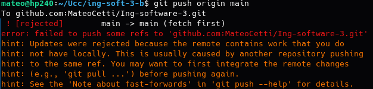
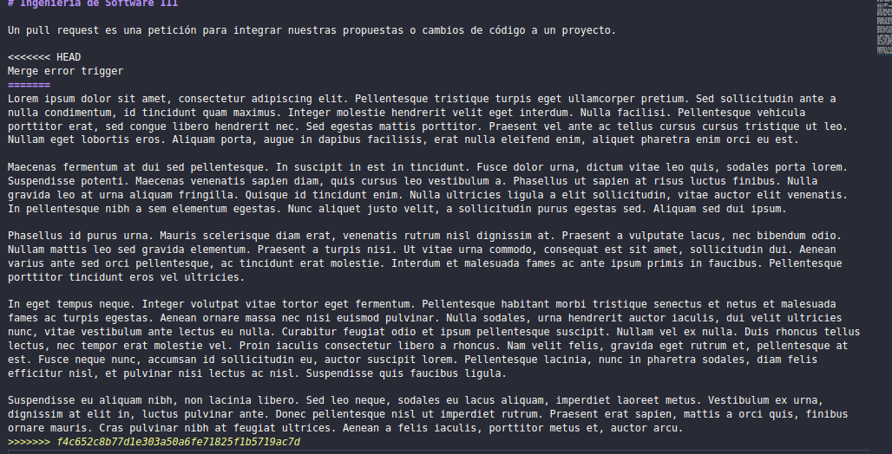
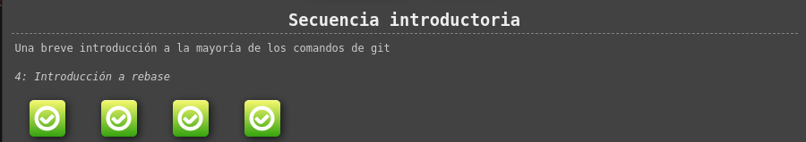

# Trabajo practico N°1

- [Trabajo practico N°1](#trabajo-practico-n1)
  - [Ejercicios 1, 2, 3,4](#ejercicios-1-2-34)
  - [Ejercicio 5](#ejercicio-5)
  - [Ejercicio 6](#ejercicio-6)
  - [Ejercicio 7](#ejercicio-7)

## Ejercicios 1, 2, 3,4 

Done!

## Ejercicio 5

Un **pull request** es una petición para integrar nuestras propuestas o cambios de código a un proyecto.

**Merge error trigger**

Lorem ipsum dolor sit amet, consectetur adipiscing elit. Pellentesque tristique turpis eget ullamcorper pretium. Sed sollicitudin ante a nulla condimentum, id tincidunt quam maximus. Integer molestie hendrerit velit eget interdum. Nulla facilisi. Pellentesque vehicula porttitor erat, sed congue libero hendrerit nec. Sed egestas mattis porttitor. Praesent vel ante ac tellus cursus cursus tristique ut leo. Nullam eget lobortis eros. Aliquam porta, augue in dapibus facilisis, erat nulla eleifend enim, aliquet pharetra enim orci eu est.

Maecenas fermentum at dui sed pellentesque. In suscipit in est in tincidunt. Fusce dolor urna, dictum vitae leo quis, sodales porta lorem. Suspendisse potenti. Maecenas venenatis sapien diam, quis cursus leo vestibulum a. Phasellus ut sapien at risus luctus finibus. Nulla gravida leo at urna aliquam fringilla. Quisque id tincidunt enim. Nulla ultricies ligula a elit sollicitudin, vitae auctor elit venenatis. In pellentesque nibh a sem elementum egestas. Nunc aliquet justo velit, a sollicitudin purus egestas sed. Aliquam sed dui ipsum.

Phasellus id purus urna. Mauris scelerisque diam erat, venenatis rutrum nisl dignissim at. Praesent a vulputate lacus, nec bibendum odio. Nullam mattis leo sed gravida elementum. Praesent a turpis nisi. Ut vitae urna commodo, consequat est sit amet, sollicitudin dui. Aenean varius ante sed orci pellentesque, ac tincidunt erat molestie. Interdum et malesuada fames ac ante ipsum primis in faucibus. Pellentesque porttitor tincidunt eros vel ultricies.

In eget tempus neque. Integer volutpat vitae tortor eget fermentum. Pellentesque habitant morbi tristique senectus et netus et malesuada fames ac turpis egestas. Aenean ornare massa nec nisi euismod pulvinar. Nulla sodales, urna hendrerit auctor iaculis, dui velit ultricies nunc, vitae vestibulum ante lectus eu nulla. Curabitur feugiat odio et ipsum pellentesque suscipit. Nullam vel ex nulla. Duis rhoncus tellus lectus, nec tempor erat molestie vel. Proin iaculis consectetur libero a rhoncus. Nam velit felis, gravida eget rutrum et, pellentesque at est. Fusce neque nunc, accumsan id sollicitudin eu, auctor suscipit lorem. Pellentesque lacinia, nunc in pharetra sodales, diam felis efficitur nisl, et pulvinar nisi lectus ac nisl. Suspendisse quis faucibus ligula.

Suspendisse eu aliquam nibh, non lacinia libero. Sed leo neque, sodales eu lacus aliquam, imperdiet laoreet metus. Vestibulum ex urna, dignissim at elit in, luctus pulvinar ante. Donec pellentesque nisl ut imperdiet rutrum. Praesent erat sapien, mattis a orci quis, finibus ornare mauris. Cras pulvinar nibh at feugiat ultrices. Aenean a felis iaculis, porttitor metus et, auctor arcu.

**Git error**:

**Conflict**:

**Local, remote y base**:

Git performs a **three-way merge**, finding the common **ancestor** (aka "merge base") of the two branches you are merging. When you invoke git mergetool on a conflict, it will produce these files suitable for feeding into a typical 3-way merge tool. Thus:

* foo.**LOCAL**: the "**ours**" **side** of the conflict - ie, your branch (HEAD) that will contain the results of the merge
* foo.**REMOTE**: the "**theirs**" **side** of the conflict - the branch you are merging into HEAD
* foo.**BASE**: the **common ancestor**. useful for feeding into a three-way merge tool

## Ejercicio 6

**learngitbranching Introductory sequence**:

## Ejercicio 7

Done!