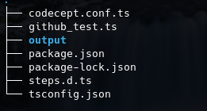
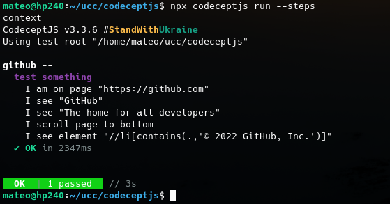
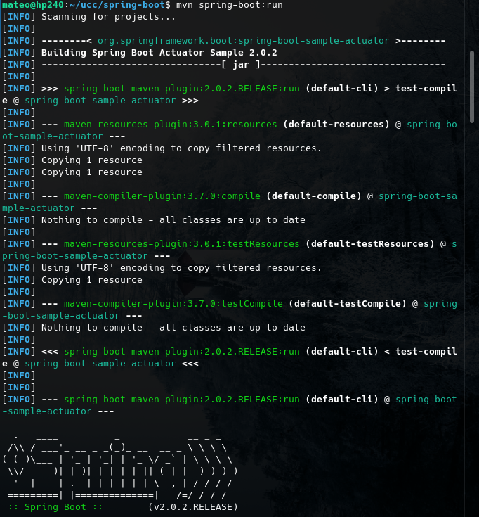
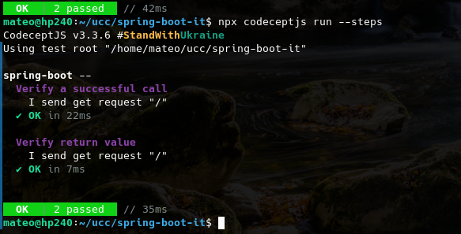
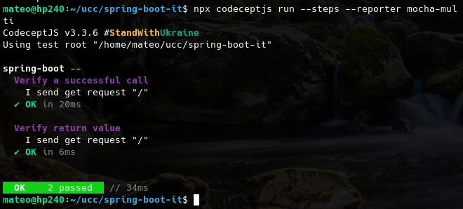
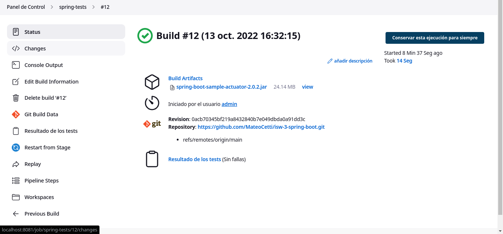
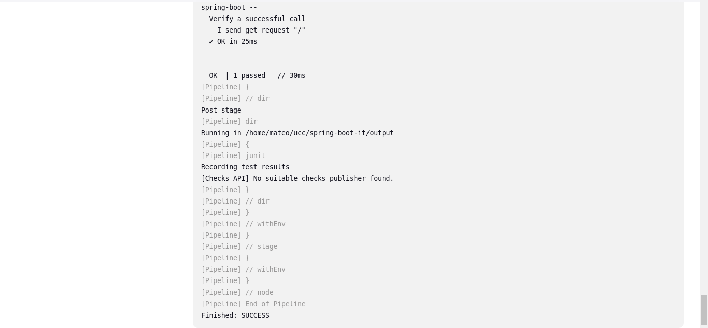

# Trabajo practico N° 10

- [Trabajo practico N° 10](#trabajo-practico-n-10)
  - [Ejercicio 1](#ejercicio-1)
  - [Ejercicio 2](#ejercicio-2)
  - [Ejercicio 3](#ejercicio-3)
  - [Ejercicio 4](#ejercicio-4)
  - [Ejercicio 5](#ejercicio-5)

## Ejercicio 1

El objeto `I`es un actor, que vendria a reemplazar a un usario de prueba o __"testeo"__, que nos permitira realizar distintas acciones de manera autmatizada sobre la aplicación.

## Ejercicio 2

Instalamos el proyecto:



Modificamos el archivo y ejecutamos los tests:



Instalamos el selector (en este caso )


## Ejercicio 3

Realizamos las instalaciones y cambios especificados, levantamos una aplicación de spring-boot:



y corremos los tests:



Como podemos ver, ambos tests se ejecutaron correctamente.

## Ejercicio 4

Realizamos las instalaciones y los cambios, y ejecutamos los tests, obteniendo los siguientes resultados:




## Ejercicio 5

Creamos un nuevo pipeline, con el siguiente script:

```jenkinsfile
pipeline {
    agent any

    tools {
        // Install the Maven version configured as "M3" and add it to the path.
        maven "M3"
    }

    stages {
        stage('Build') {
            steps {
                // Get some code from a GitHub repository
                git branch: "main", url: 'https://github.com/MateoCetti/isw-3-spring-boot.git'

                // Run Maven on a Unix agent.
                sh "mvn -Dmaven.test.failure.ignore=true clean package"

                // To run Maven on a Windows agent, use
                // bat "mvn -Dmaven.test.failure.ignore=true clean package"
            }

            post {
                // If Maven was able to run the tests, even if some of the test
                // failed, record the test results and archive the jar file.
                success {
                    junit '**/target/surefire-reports/TEST-*.xml'
                    archiveArtifacts 'target/*.jar'
                }
            }
        }
        stage('test') {
            steps {
                dir("/home/mateo/ucc/spring-boot-it/"){
                    sh "npx codeceptjs run --steps --reporter mocha-multi"   
                }
            }

            post {
                success {
                    dir("/home/mateo/ucc/spring-boot-it/output/"){
                        junit 'result.xml'
                    }
                }
            }
        }
    }
}
```

obteniendo el siguiente output:


