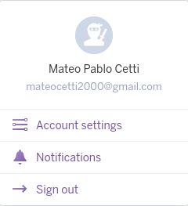
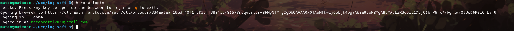
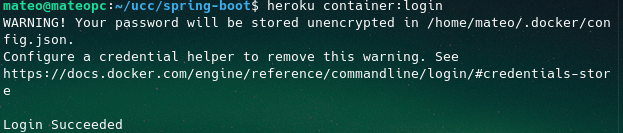
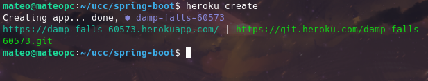
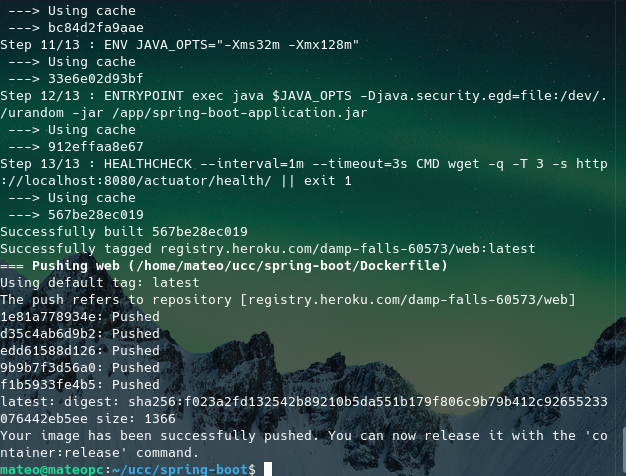
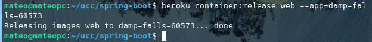
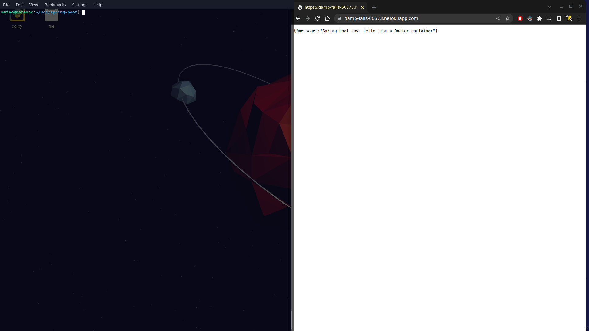

# Trabajo practico N°12

- [Trabajo practico N°12](#trabajo-practico-n12)
  - [Ejercicio 1](#ejercicio-1)
  - [Ejercicio 2](#ejercicio-2)

## Ejercicio 1

Creamos una cuenta



e iniciamos sesion en nuestro CLI despues de descargar el cliente de heroku:





## Ejercicio 2

Modificamos el archivo dockerfile tal que quede de la siguiente manera:

```Dockerfile
FROM maven:3.5.2-jdk-8-alpine AS MAVEN_TOOL_CHAIN
COPY pom.xml /tmp/
RUN mvn -B dependency:go-offline -f /tmp/pom.xml -s /usr/share/maven/ref/settings-docker.xml
COPY src /tmp/src/
WORKDIR /tmp/
RUN mvn -B -s /usr/share/maven/ref/settings-docker.xml package

FROM openjdk:8-jre-alpine

ENV PORT=8080

EXPOSE 8080

RUN mkdir /app
COPY --from=MAVEN_TOOL_CHAIN /tmp/target/*.jar /app/spring-boot-application.jar

# ENV JAVA_OPTS="-Xms32m -Xmx128m"

CMD ["java", "-Xms32m", "-Xmx128m", "-jar", "-Dserver.port=${PORT}", "-Djava.security.egd=file:/dev/./urandom", "/app/spring-boot-application.jar"]
```

Y creamos la app:



Luego la pusheamos y le aplicamos el release web




Al hacer un GET a `/` obtenemos lo siguiente:

