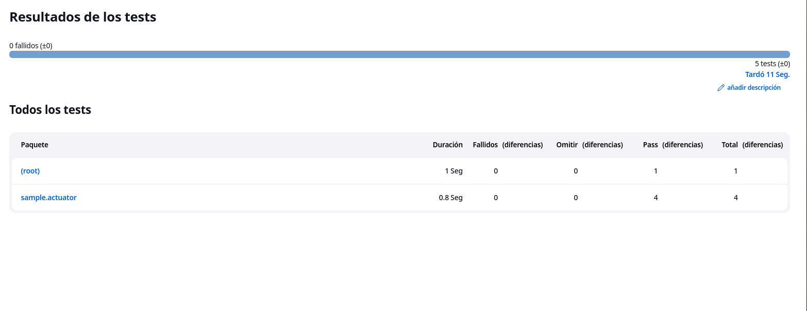

# Trabajo practico N°12

- [Trabajo practico N°12](#trabajo-practico-n12)
  - [Ejercicio 1](#ejercicio-1)
  - [Ejercicio 2](#ejercicio-2)
  - [Ejercicio 3](#ejercicio-3)

## Ejercicio 1

Creamos una cuenta


e iniciamos sesion en nuestro CLI despues de descargar el cliente de heroku:


## Ejercicio 2

Modificamos el archivo dockerfile tal que quede de la siguiente manera:

```Dockerfile
FROM maven:3.5.2-jdk-8-alpine AS MAVEN_TOOL_CHAIN
COPY pom.xml /tmp/
RUN mvn -B dependency:go-offline -f /tmp/pom.xml -s /usr/share/maven/ref/settings-docker.xml
COPY src /tmp/src/
WORKDIR /tmp/
RUN mvn -B -s /usr/share/maven/ref/settings-docker.xml package

FROM openjdk:8-jre-alpine

ENV PORT=8080

EXPOSE 8080

RUN mkdir /app
COPY --from=MAVEN_TOOL_CHAIN /tmp/target/*.jar /app/spring-boot-application.jar

# ENV JAVA_OPTS="-Xms32m -Xmx128m"

CMD ["java", "-Xms32m", "-Xmx128m", "-jar", "-Dserver.port=${PORT}", "-Djava.security.egd=file:/dev/./urandom", "/app/spring-boot-application.jar"]
```

Y creamos la app:


Luego la pusheamos y le aplicamos el release web


Al hacer un GET a `/` obtenemos lo siguiente:


## Ejercicio 3

Modificamos el script del job de jenkins:

```
pipeline {
    agent any

    tools {
        // Install the Maven version configured as "M3" and add it to the path.
        maven "M3"
    }

    stages {
        stage('Build') {
            steps {
                // Get some code from a GitHub repository
                git branch: "main", url: 'https://github.com/MateoCetti/isw-3-spring-boot.git'

                // Run Maven on a Unix agent.
                sh "mvn -Dmaven.test.failure.ignore=true clean package"

                // To run Maven on a Windows agent, use
                // bat "mvn -Dmaven.test.failure.ignore=true clean package"
            }

            post {
                // If Maven was able to run the tests, even if some of the test
                // failed, record the test results and archive the jar file.
                success {
                    junit '**/target/surefire-reports/TEST-*.xml'
                    archiveArtifacts 'target/*.jar'
                }
            }
        }
        stage('heroku-post') {
            steps {
                // Get some code from a GitHub repository

                // Run Maven on a Unix agent.
                
                sh "heroku container:login"
                
                sh "heroku container:push web --app=spring-boot-mateo-cetti"
                
                sh "heroku container:release web --app=spring-boot-mateo-cetti"
                

                // To run Maven on a Windows agent, use
                // bat "mvn -Dmaven.test.failure.ignore=true clean package"
            }
        }
        stage('test') {
            steps {
                dir("/home/mateo/ucc/spring-boot-it/"){
                    sh "npx codeceptjs run --steps --reporter mocha-multi"   
                }
            }

            post {
                success {
                    dir("/home/mateo/ucc/spring-boot-it/output/"){
                        junit 'result.xml'
                    }
                }
            }
        }
    }
}
```


y al ejecutarlo obtenemos los siguientes resultados:

