# Trabajo practico N°2

- [Trabajo practico N°2](#trabajo-practico-n2)
  - [Ejercicio 1](#ejercicio-1)
  - [Ejercicio 2](#ejercicio-2)
  - [Ejercicio 3](#ejercicio-3)
  - [Ejercicio 4](#ejercicio-4)
  - [Ejercicio 5](#ejercicio-5)
  - [Ejercicio 6](#ejercicio-6)
  - [Ejercicio 7](#ejercicio-7)
  - [Ejercicio 8](#ejercicio-8)
  - [Ejercicio 9](#ejercicio-9)
  - [Ejercicio 10](#ejercicio-10)

## Ejercicio 1

**Version** de docker instalada:

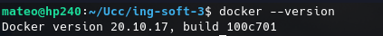

## Ejercicio 2

**Cuenta creada** y familiarizandome con **docker-hub**:

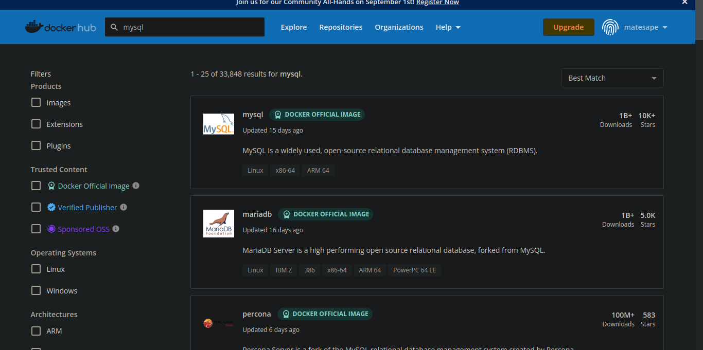

## Ejercicio 3

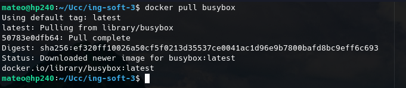

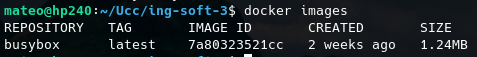

## Ejercicio 4

No se obtuvo nada porque el comando no se ejecuto con las **flags**:
* **-d**: detached mdoe
* **-it**: interactive mode

O algun otro modo, por lo que el contenedor (en este caso busybox) se **ejecuta** exitosamente y posteriormente **termina** su ejecución sin emitir ningun tipo de **log** en consola.

## Ejercicio 5

Creamos el contenedor de manera **interactiva** y ejecutamos los comandos.

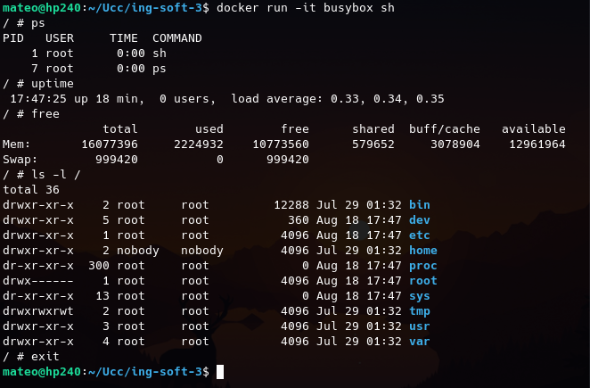

## Ejercicio 6

Vemos y **borramos** los contenedores

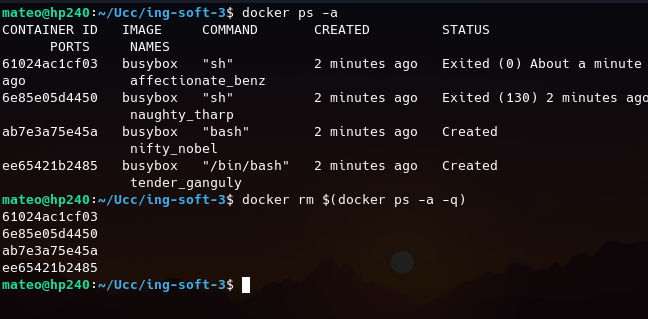

## Ejercicio 7

Ejecutando el comando

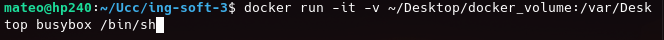

Creando el fichero dentro del directorio especificado (dentro del contenedor)

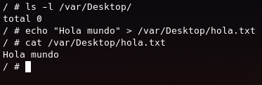

Verificando que el archivo se creo en el volumen

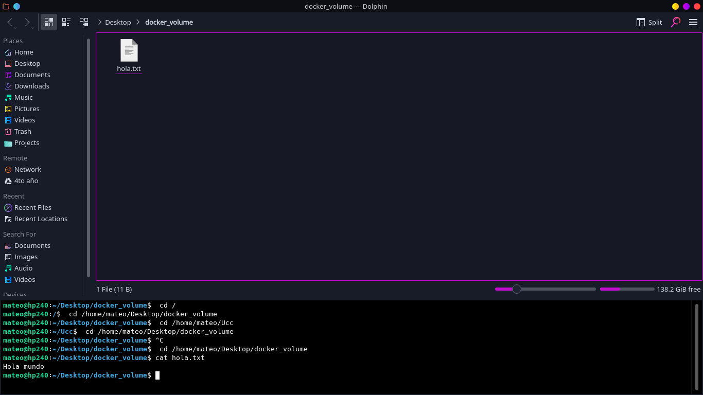

## Ejercicio 8

Ejecutamos el comando con la flag -d para que dicho contenedor se siga ejecutando en background.

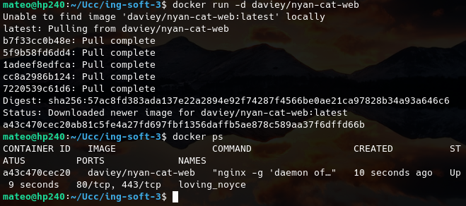

Borramos el contenedor

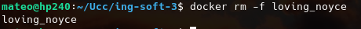

Accedemos mediante un navegador al localhost en el puerto 80 

## Ejercicio 9 

Creamos el contenedor psql y el volumen (descargamos la imagen ya que no la tengo localmente)

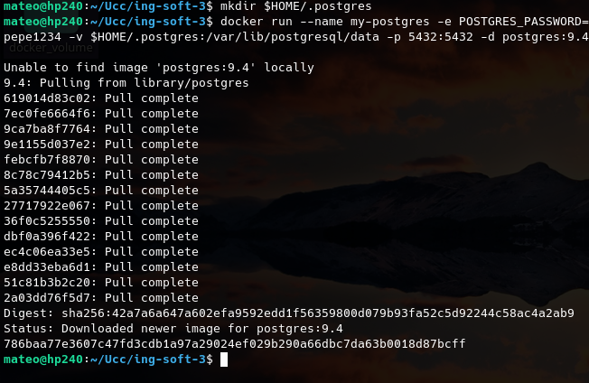

Nos metemos dentro del psql del contenedor y ejecutamos los comandos SQL.

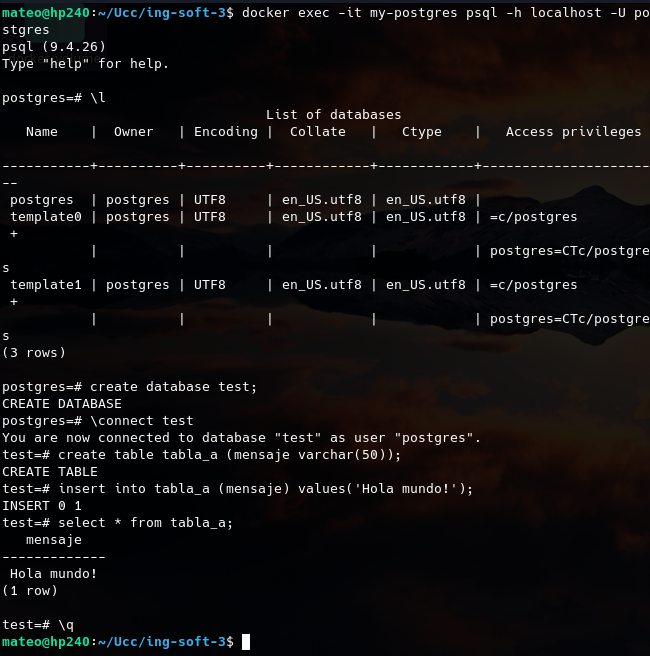

Por ultimo, interactuamos con la DB utilizando dbeaver.

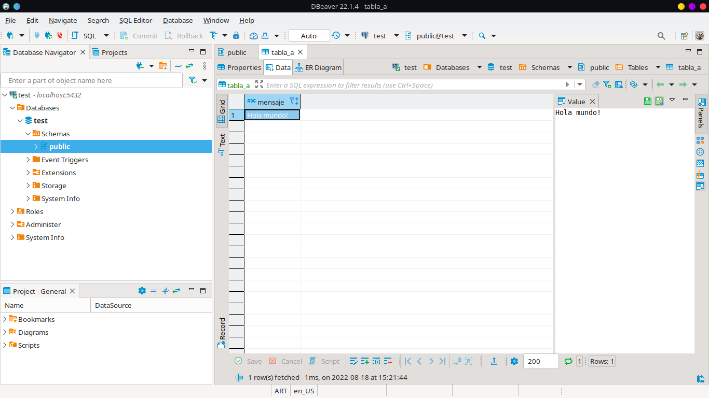

Con el comando `docker run` descargamos la imagen de psql del repositorio imagen en docker-hub a nuestro equipo local, creamos un contenedor con dicha imagen y los parametros especificados en las flags escritas al correr dicho comando y levanta dicho contenedor.

En cambio con `docker exec` ejecutamos un comando (en este caso `psql -h localhost -U postgres`) en un contenedor que ya esta corriendo.

## Ejercicio 10

Es este documento.