# Trabajo practico N° 3

- [Trabajo practico N° 3](#trabajo-practico-n-3)
  - [Ejercicio 1](#ejercicio-1)
  - [Ejercicio 2](#ejercicio-2)
  - [Ejercicio 3](#ejercicio-3)
  - [Ejercicio 4](#ejercicio-4)
  - [Ejercicio 5](#ejercicio-5)

## Ejercicio 1

Por defecto el driver utilizado para crear la network es "bridge" por lo que me saltee la flag `-d`

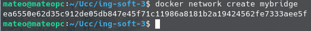

Creamos el contenedor con redis y lo conectamos  a la red "mybridge"

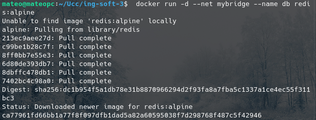

Creamos una app web que consuma esta db, conectando dicho contenedor a la red "mibridge" (En este caso la app web es una app creada en python con flask). Para ello establecemos como variables de entorno (mediante la flag `-e` el host del redis que como el contenedor se encuentra en la red se puede referenciar como "db" y el puerto)

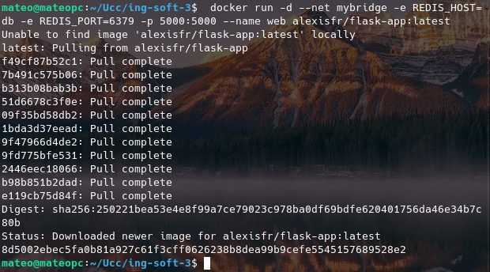

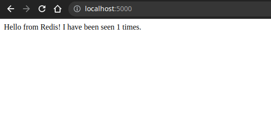

Listamos los contenedores y networks creados

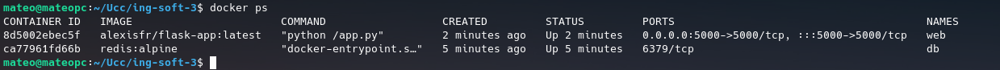

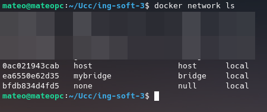

Detallamos la info de la red "mybridge"

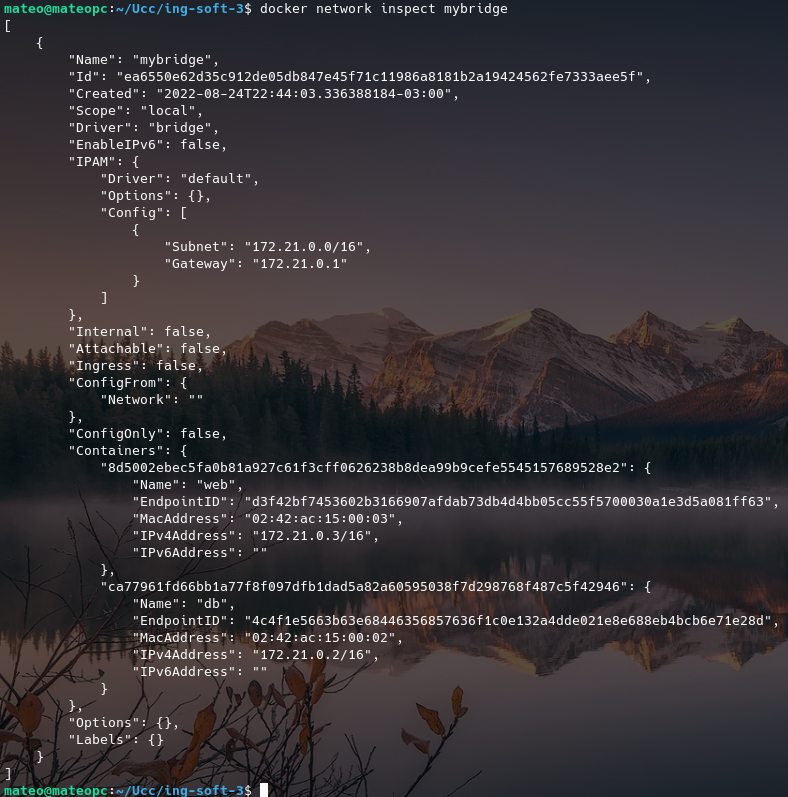

Los respectivos comandos se encuentran en las caputras de pantalla

## Ejercicio 2

El sistema importa las librerias:

* `os`: para poder leer las variables de entorno del sistema (o contenedor).
* `flask`: para poder crear una aplicación web de manera rapida y simple.
* `redis`: para poder conectarse a una instancia de redis con python.

Luego crea una aplicación de flask, crea una conexión a **redis** mediante las utilidades provistas por las libreria de python `redis` y `os` (esta ultima para obtener las variables de entorno con el host y port de la instancia de redis) y  y establece una variable "global" con el **puerto** que se abrira para **exponer** el servicio.

Luego, haciendo uso de flask, creamos una ruta para el directorio o endpoint "raiz" o index el cual incrementara en uno el contador de hits almacenado en redis, obtendra la cantidad de hits de dicho contador y lo devolvera en un string formateado.

Por ultimo, en el caso en el que el script se corra (y no se importe como modulo) se correra  la aplicación de redis definida anteriormente.

Los parametros -e establecen las variables de entorno necesarias para que la app funcione.

Si eliminamos y volvemos a crear un contenedor web, no sucede nada extraño, es mas, ni se pierden los datos de los hits registrados en redis.

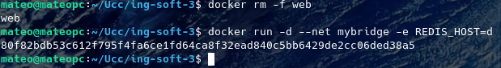

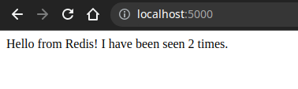

Sin embargo, cuando borramos el contenedor de redis y recargamos la app web, esta devuelve un error ya que intenta conectarse con la instancia de redis, pero como la borramos, esta es inexistente.

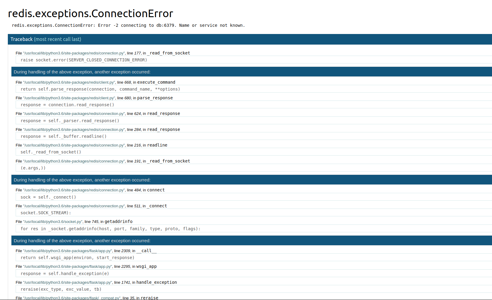

Al levantarlo de nuevo, la app vuelve a funcionar sin problemas (al recargar la pagina), pero el contador de hits se a reiniciado a 0 debido a que los datos se eliminaron cuando eliminamos el contenedor de redis. Para que esto no suceda, deberiamos de crear un volumen y linkearlo al contenedor, de tal manera que los datos persistan en dicho volumen, independientemente de que si el contenedor se borre o no.

Corremos los comandos:

```bash
docker rm -f db
docker rm -f web
docker network rm mybridge
```

y borramos los contenedores y la red.

## Ejercicio 3

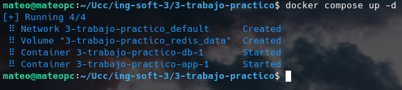

Lo que hizo docker compose fue basicamente realizar todo lo que hicimos en el ejercicio 1 de manera automatizada y solo con escribir un simple script en `.yaml`, ademas de crear un **volumen** para redis.

## Ejercicio 4

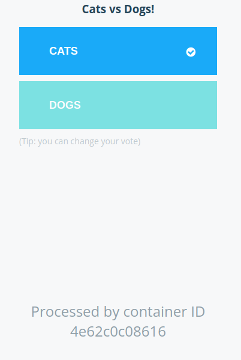

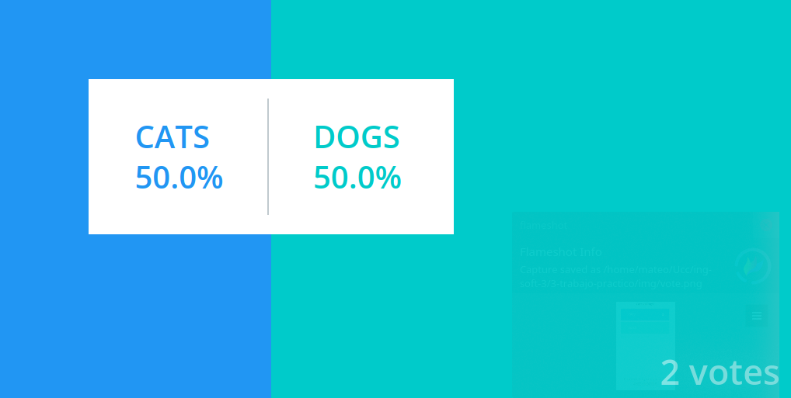

El codigo del archivo `docker-compose` es el siguiente:

```yaml
# version is now using "compose spec"
# v2 and v3 are now combined!
# docker-compose v1.27+ required

services:
  vote:
    build: ./vote
    # use python rather than gunicorn for local dev
    command: python app.py
    depends_on:
      redis:
        condition: service_healthy 
    volumes:
     - ./vote:/app
    ports:
      - "5000:80"
    networks:
      - front-tier
      - back-tier

  result:
    build: ./result
    # use nodemon rather than node for local dev
    command: nodemon server.js
    depends_on:
      db:
        condition: service_healthy 
    volumes:
      - ./result:/app
    ports:
      - "5001:80"
      - "5858:5858"
    networks:
      - front-tier
      - back-tier

  worker:
    build:
      context: ./worker
    depends_on:
      redis:
        condition: service_healthy 
      db:
        condition: service_healthy 
    networks:
      - back-tier

  redis:
    image: redis:5.0-alpine3.10
    volumes:
      - "./healthchecks:/healthchecks"
    healthcheck:
      test: /healthchecks/redis.sh
      interval: "5s"
    ports: ["6379"]
    networks:
      - back-tier

  db:
    image: postgres:9.4
    environment:
      POSTGRES_USER: "postgres"
      POSTGRES_PASSWORD: "postgres"
    volumes:
      - "db-data:/var/lib/postgresql/data"
      - "./healthchecks:/healthchecks"
    healthcheck:
      test: /healthchecks/postgres.sh
      interval: "5s"
    networks:
      - back-tier

volumes:
  db-data:

networks:
  front-tier:
  back-tier:
```

Este sistema esta compuesto por 5 servicios:
* **vote**: Una aplicación web que permite emitir un voto entre perros y gatos 
* **result**: Otra app web que nos permite visualizar los resultados de la votación
* **worker**: Un servicio en java que recibe los votos y los envia a una db
* **redis**: Una cola que recolecta los votos.
* **db**: Una base de datos postgress que almacena los votos.

Este sistema contiene 2 redes, `front-tier` y `back-tier`.
* `front-tier`: Conecta los contenedores **vote** y **result**
* `back-tear`: Conecta practicamente todos los contenedores

El sistema tiene distintos volumenes:
* un volumen para el servicio **vote**
* Otro para **result**
* Uno para **redis**
* y 2 para la **DB**

Y por ultimo, los puertos abiertos y "forwardeados" al host son el `5000`, `5001` y `5858`

## Ejercicio 5

Abrimos los puertos y accedemos a la base de datos

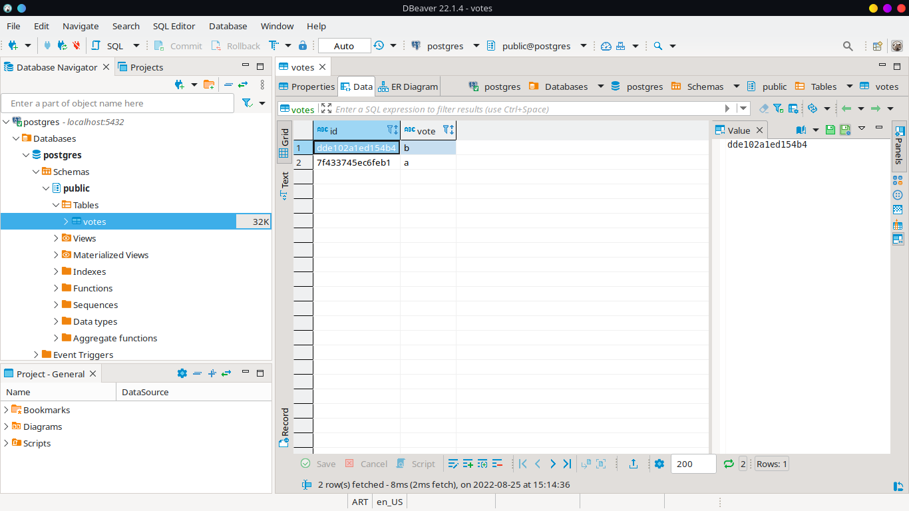

Nos conectamos a redis

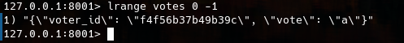


`string json = redis.ListLeftPopAsync("votes").Result;`

El codigo de python de votos envia dichos votos mediante la siguiente estructura:

```py
if request.method == 'POST':
    redis = get_redis()
    vote = request.form['vote']
    app.logger.info('Received vote for %s', vote)
    data = json.dumps({'voter_id': voter_id, 'vote': vote})
    redis.rpush('votes', data)
```

que corresponde a las lineas 32 a 37 del archivo `app.py`. Estas lineas dictan que si el tipo de request es **POST**, obtenemos la instancia de redis y añadimos un voto en la lista "**votes**".

El worker esta permanentemente escuchando el redis. Una vez el voto se ha pusheado en dicha instancia de redis, el worker lo recibe, lo procesa y se lo envia a la instancia de postgress, mediante las siguientes estructuras de codigo:

**Obtener los votos de redis**

```java
while (true) {
  String voteJSON = redis.blpop(0, "votes").get(1);
  JSONObject voteData = new JSONObject(voteJSON);
  String voterID = voteData.getString("voter_id");
  String vote = voteData.getString("vote");

  System.err.printf("Processing vote for '%s' by '%s'\n", vote, voterID);
  updateVote(dbConn, voterID, vote);
}
```

y la función updateVote **actualiza** los registros en **postgress**:

```java
static void updateVote(Connection dbConn, String voterID, String vote) throws SQLException {
  PreparedStatement insert = dbConn.prepareStatement(
    "INSERT INTO votes (id, vote) VALUES (?, ?)");
  insert.setString(1, voterID);
  insert.setString(2, vote);

  try {
    insert.executeUpdate();
  } catch (SQLException e) {
    PreparedStatement update = dbConn.prepareStatement(
      "UPDATE votes SET vote = ? WHERE id = ?");
    update.setString(1, vote);
    update.setString(2, voterID);
    update.executeUpdate();
  }
}
```

Por ultimo, el archivo `server.js` de la app web "**responses**", realiza 1000 peticiones en un intervalo de 1000 segundos por peticion a postgres con una query que trae los votos, los procesa y los muestra dinamicamente en pantalla. El codigo correspondiente es el siguiente:

```js
async.retry(
  {times: 1000, interval: 1000},
  function(callback) {
    pool.connect(function(err, client, done) {
      if (err) {
        console.error("Waiting for db");
      }
      callback(err, client);
    });
  },
  function(err, client) {
    if (err) {
      return console.error("Giving up");
    }
    console.log("Connected to db");
    getVotes(client);
  }
);

function getVotes(client) {
  client.query('SELECT vote, COUNT(id) AS count FROM votes GROUP BY vote', [], function(err, result) {
    if (err) {
      console.error("Error performing query: " + err);
    } else {
      var votes = collectVotesFromResult(result);
      io.sockets.emit("scores", JSON.stringify(votes));
    }

    setTimeout(function() {getVotes(client) }, 1000);
  });
}
```

[Documento de arquitectura](arquitectura.md)