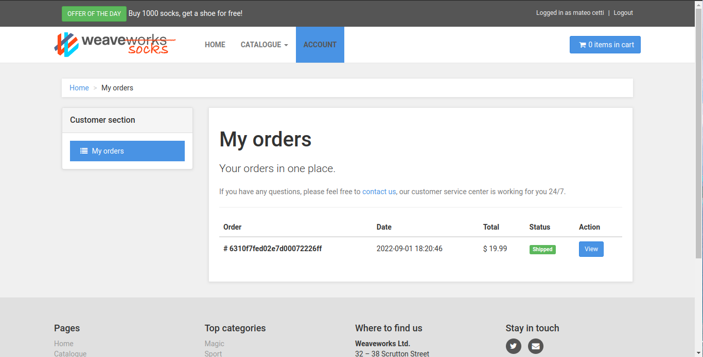
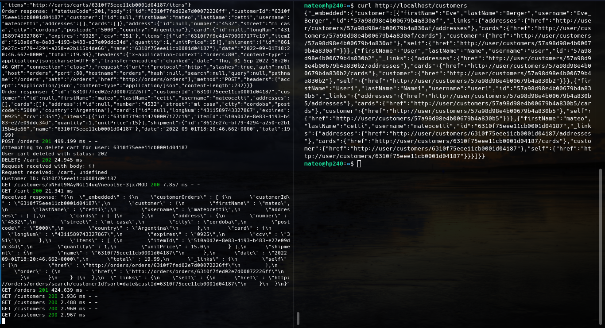
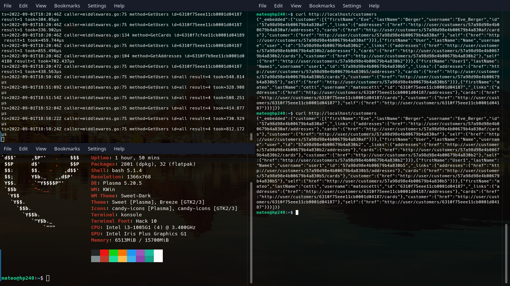
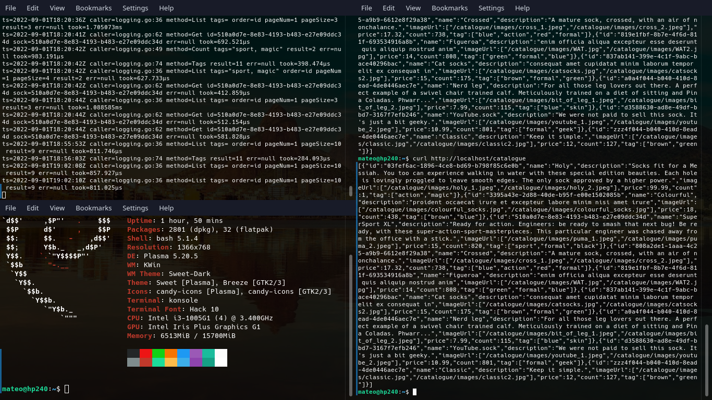

# Trabajo practico N° 4

- [Trabajo practico N° 4](#trabajo-practico-n-4)
  - [Ejercicio 1](#ejercicio-1)
  - [Ejercicio 2](#ejercicio-2)
    - [Pregunta 1](#pregunta-1)
    - [Pregunta 2 y 3](#pregunta-2-y-3)
    - [Pregunta 4](#pregunta-4)
    - [Pregunta 5 y 6](#pregunta-5-y-6)
    - [Pregunta 7](#pregunta-7)
    - [Pregunta 8](#pregunta-8)
    - [Pregunta 9](#pregunta-9)
    - [pregunta 10](#pregunta-10)

## Ejercicio 1

## Ejercicio 2

### Pregunta 1

Contenedores:

* [Puerto 80 | Enpoint /app] docker-compose-catalogue-1
* [Puerto 80 | Endpoint /user] docker-compose-user-1
* [Puerto 27017] docker-compose-carts-db-1
* [] docker-compose-carts-1
* [Puerto 3306] docker-compose-catalogue-db-1
* [Puerto 27017] docker-compose-orders-db-1
* [puerto 8079] docker-compose-front-end-1
* [] docker-compose-queue-master-1
* [Puertos 4369 / 5671-5672 / 25672] docker-compose-rabbitmq-1
* [Puerto 80] docker-compose-payment-1
* [] docker-compose-orders-1
* [] docker-compose-shipping-1
* [Puerto 27017] docker-compose-user-db-1
* [Puertos 80 / 8080] docker-compose-edge-router-1 (abiertos al sistema host)

### Pregunta 2 y 3

Se utilizan repositorios separados debido a que cada contenedor es un proyecto separado que brinda un servicio en particular que otros (micro)servicios consumiran / utilizaran en conjunto para brindar una solución general que satisfaga las necesidades del "cliente". Un punto a favor que le encuentro a esta arquitectura es que cada microservicio es atomico en el sentido que puede desarrollar su logica interna independientemente de los demas microservicios siempre y cuando mantenga la interfaz mediante la cual los demas servicios interactuan intacta. Un punto en contra que podria destacar es que uno debe tener en cuenta y recordar un numero mayor de repos, hecho que puede llegar a ser un poco tedioso en contraste con tener un solo repositorio central.

### Pregunta 4

El contenedor que funciona como api gateway es el `edge-router`:

"*Traefik is an Edge Router, it means that it's the door to your platform, and that it intercepts and routes every incoming request: it knows all the logic and every rule that determine which services handle which requests (based on the path, the host, headers, and so on ...).*"

### Pregunta 5 y 6

El contenedor que recibe la operación es (en un principio) el frontend-1

Que a su vez lo deriva a customers-1

### Pregunta 7

En estos casos, el frontend deriva las requests a catalogue-1

(En estos casos estoy escribiendo el comando `docker logs -f [nombre del contenedor]`)

### Pregunta 8

Los datos persisten en los distintos contenedores que en el nombre contienen `db`. Estos contenedores son consumidos por sus respectivos servicios.

### Pregunta 9

El componente encargado de la cola de mensajes es `queue-master-1`

### pregunta 10

Api rest