# Trabajo practico N°5

- [Trabajo practico N°5](#trabajo-practico-n5)
  - [Ejercicios 1 y 2](#ejercicios-1-y-2)
  - [Ejercicio 3](#ejercicio-3)
  - [Ejercicio 4](#ejercicio-4)
  - [Ejercicio 6](#ejercicio-6)
  - [Ejercicio 7](#ejercicio-7)
  - [Ejercicio 8](#ejercicio-8)
  - [Ejercicio 9](#ejercicio-9)
  - [Ejercicio 10](#ejercicio-10)

## Ejercicios 1 y 2

Instalamos JDK y Maven siguiendo los respectivos tutoriales en sus paginas principales para el SO correspondiente (en mi caso gnu-linux | Debian). Para verificar la correcta instalación, utilizamos el parametro  `-v`

## Ejercicio 3

**Qué es Maven?**

Apache Maven es una **herramienta** de **comprensión** y **gestión** de **proyectos** de **software**. Basado en el concepto de un **modelo de objetos de proyecto** (POM), Maven puede **administrar** la **construcción**, los **informes** y la **documentación** de un proyecto desde una **pieza central** de información.

Maven, una palabra yiddish que significa acumulador de conocimiento, comenzó como un intento de **simplificar** los **procesos** de **construcción** en el proyecto de turbinas de Yakarta. Había varios proyectos, cada uno con sus propios archivos de compilación de Ant, que eran ligeramente diferentes. Los JAR se registraron en CVS. Queríamos una forma **estándar** de construir los proyectos, una definición clara de en qué consistía el proyecto, una forma fácil de publicar información del proyecto y una forma de compartir archivos JAR entre varios proyectos.

El resultado es una herramienta que ahora se puede usar para **construir** y **administrar** cualquier proyecto basado en Java. Esperamos haber creado algo que facilite el trabajo diario de los desarrolladores de Java y, en general, ayude con la comprensión de cualquier proyecto basado en Java.

**Que es el archivo POM?**

POM significa "Modelo de objetos de proyecto". Es una representación **XML** de un proyecto Maven contenido en un archivo llamado `pom.xml`. Cuando estamos en presencia de la gente de Maven, hablar de un proyecto es hablar en el sentido filosófico, más allá de una mera colección de archivos que contienen código. Un proyecto contiene archivos de configuración, así como los desarrolladores involucrados y las funciones que desempeñan, el sistema de seguimiento de defectos, la organización y las licencias, la URL de donde vive el proyecto, las dependencias del proyecto y todas las demás pequeñas piezas que entran en juego. jugar para darle vida al código. Es una ventanilla única para todo lo relacionado con el proyecto. De hecho, en el mundo de Maven, un proyecto no necesita contener ningún código, simplemente un `pom.xml`.

Hay una lista de los elementos que necesita tener el archivo `pom.xml` para poder funcionar. Dentro de estos se encuentra em `modelVersion`, elemento que dice la versión del modelo a utilizar (actualmente 4.0.0).

Los campos `groupId:artifactId:version` son todos campos obligatorios (aunque no es necesario definir explícitamente groupId y versión si se heredan de un padre; más adelante se hablará más sobre la herencia). Los tres campos actúan como una **dirección** y una **marca de tiempo** en uno. Esto marca un lugar específico en un repositorio, actuando como un **sistema de coordenadas** para proyectos Maven.

**Repos locales, centrales y remotos**

Un repositorio en Maven contiene artefactos de compilación y dependencias de diferentes tipos.

Hay exactamente **dos tipos** de repositorios: locales y remotos:

el repositorio **local** es un directorio en la computadora donde se ejecuta Maven. Almacena en caché las descargas remotas y contiene artefactos de compilación temporales que aún no ha publicado.

Los repositorios **remotos** se refieren a cualquier otro tipo de repositorio, al que se accede mediante una variedad de protocolos, como file:// y https://. Estos repositorios pueden ser un repositorio verdaderamente remoto configurado por un tercero para proporcionar sus artefactos para descargar (por ejemplo, repo.maven.apache.org). Otros repositorios "remotos" pueden ser repositorios internos configurados en un servidor de archivos o HTTP dentro de su empresa, utilizados para compartir artefactos privados entre equipos de desarrollo y para lanzamientos.

Los repositorios locales y remotos están estructurados de la misma manera para que los scripts se puedan ejecutar en cualquier lado o se puedan sincronizar para su uso sin conexión. Sin embargo, el diseño de los repositorios es completamente transparente para el usuario de Maven.

**Ciclos de vida de build**

Maven se basa en el concepto central de un **ciclo de vida de construcción**. Lo que esto significa es que el proceso para construir y distribuir un artefacto en particular (proyecto) está claramente **definido**.

Para la persona que construye un proyecto, esto significa que solo es necesario aprender un **pequeño conjunto de comandos** para construir cualquier proyecto de Maven, y el POM se asegurará de que obtenga los resultados que desea.

Hay tres ciclos de vida de compilación integrados: **default**, **clean** y **site**. El ciclo de vida predeterminado maneja la implementación de su proyecto, el ciclo de vida limpio maneja la limpieza del proyecto, mientras que el ciclo de vida del sitio maneja la creación del sitio web de su proyecto.


**Clean Lifecycle**

* **pre-clean**: execute processes needed prior to the actual project cleaning
* **clean**: remove all files generated by the previous build
* **post-clean**: execute processes needed to finalize the project cleaning

**Default Lifecycle**

* **validate**: validate the project is correct and all necessary information is available.
* **initialize**: initialize build state, e.g. set properties or create directories.
* **generate-sources**: generate any source code for inclusion in compilation.
* **process-sources**:	process the source code, for example to filter any values.
* **generate-resources**: generate resources for inclusion in the package.
* **process-resources**: and process the resources into the destination directory, ready for packaging.
* **compile**: compile the source code of the project.
* **process-classes**: post-process the generated files from compilation, for example to do bytecode enhancement on Java classes.
* **generate-test-sources**: generate any test source code for inclusion in compilation.
* **process-test-sources**: process the test source code, for example to filter any values.
* **generate-test-resources**: create resources for testing.
* **process-test-resources**: copy and process the resources into the test destination directory.
* **test-compile**: compile the test source code into the test destination directory
* **process-test-classes**: post-process the generated files from test compilation, for example to do bytecode enhancement on Java classes.
* **test**: run tests using a suitable unit testing framework. These tests should not require the code be packaged or deployed.
* **prepare-package**: perform any operations necessary to prepare a package before the actual packaging. This often results in an unpacked, processed version of the package.
* **package**: take the compiled code and package it in its distributable format, such as a JAR.
* **pre-integration-test**: perform actions required before integration tests are executed. This may involve things such as setting up the required environment.
* **integration-test**: process and deploy the package if necessary into an environment where integration tests can be run.
* **post-integration-test**: perform actions required after integration tests have been executed. This may including cleaning up the environment.
* **verify**: run any checks to verify the package is valid and meets quality criteria.
* **install**: install the package into the local repository, for use as a dependency in other projects locally.
* **Deploy**: done in an integration or release environment, copies the final package to the remote repository for sharing with other developers and projects.

**Site Lifecycle**

* **pre-site**	execute processes needed prior to the actual project site generation
* **site**:	generate the project's site documentation
* **post-site**:	execute processes needed to finalize the site generation, and to prepare for site deployment
* **site-deploy**: deploy the generated site documentation to the specified web server

Luego de ejecutar el comando `mvn clean install`, obtuve el siguiente resultado:

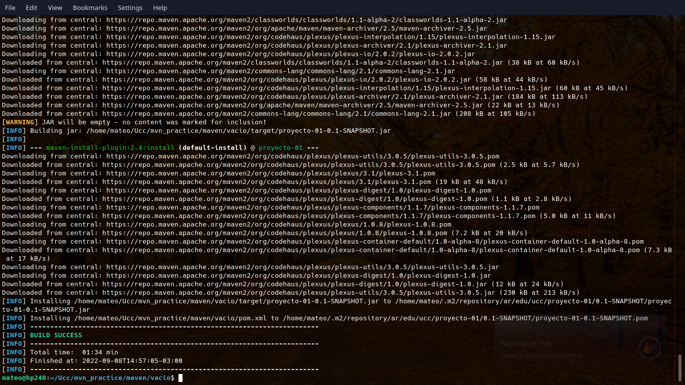

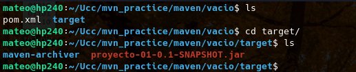

Según tengo entendido, obtuve un ejecutable `.jar` de un proyecto en un repo remoto.

## Ejercicio 4

El arbol de directorios es el siguiente:

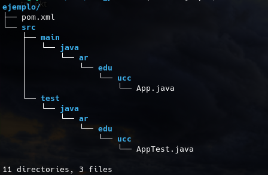

Algo destacable de este arbol de directorios es que se creo una carpeta por cada elemento separado por puntos del `groupId`, donde al ultimo se encuentra el ejecutable.

Al momento de compilar utilizando el comando especificado, el proceso nos devuelve un error:

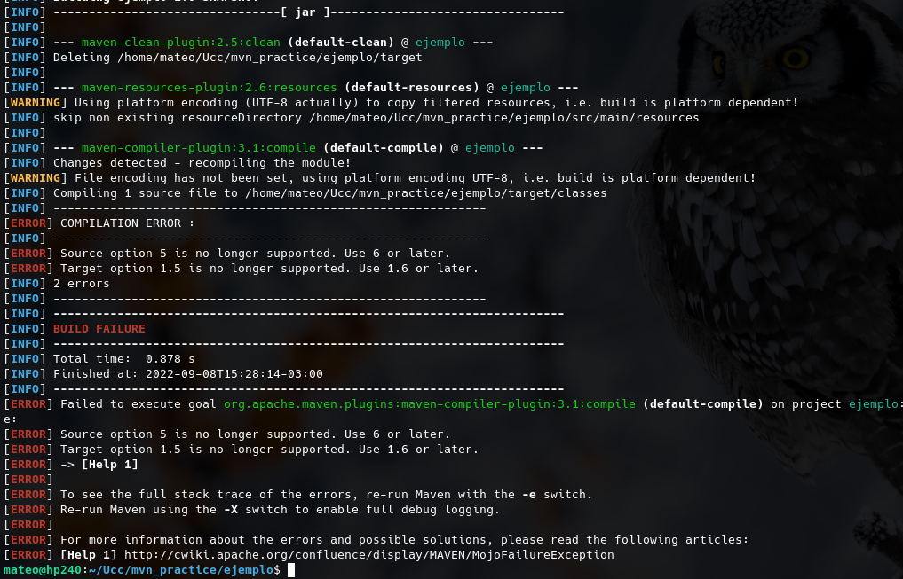

que se resuelve arreglando las siguientes lineas la archivo pom.xml:

```xml
<properties>
     <maven.compiler.source>1.8</maven.compiler.source>
     <maven.compiler.target>1.8</maven.compiler.target>
</properties>
```

Luego, ejecutamos el proyecto, obteniendo lo siguiente:


## Ejercicio 6

El error obtenido es el siguiente:

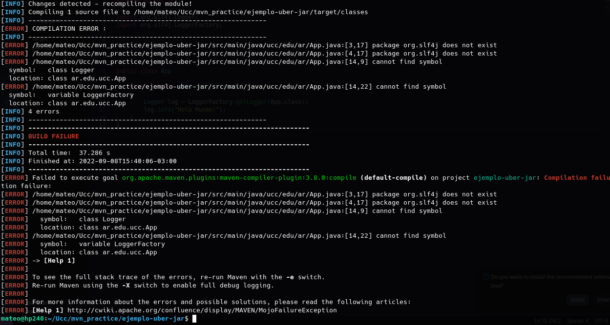

Este error se debe a que el paquete slf4j para realizar logueos no esta definido en el pom.xml como dependencia, por lo que al momento de compilar, mvn no lo descarga y por lo tanto no se encuentra al momento de ejecutar.

Luego de instalar la dependencia, el codigo compila exitosamente, se genera el jar y al ejecutarlo obtenemos el siguiente output:

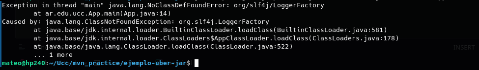

Este error se debe a que no se encuentran los ClassPath corresponientes al slf4j. Al ejecutar el comando que los arregla, obtenemos el hola mundo printeado con el logger de slf4j:

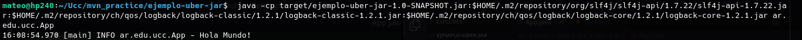

Luego de añadir al build el shade plugin, compilamos y ejecutamos el comando especificado, obteniendo el output:

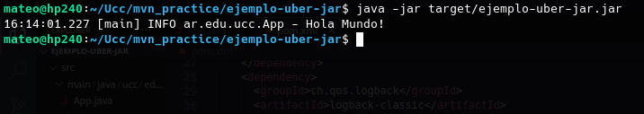

## Ejercicio 7

Abrimos el proyecto con IDEA

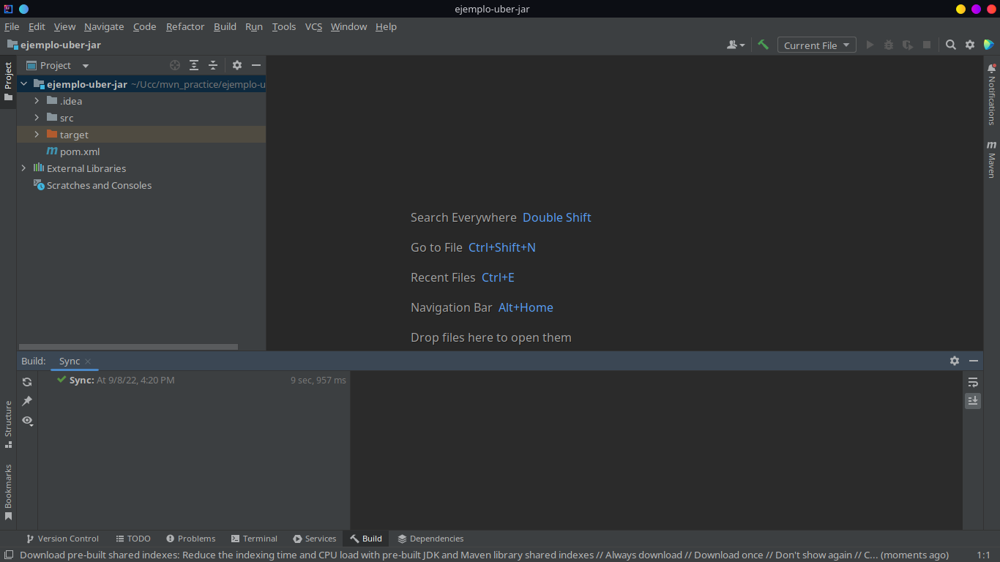

Ejecutamos la App:

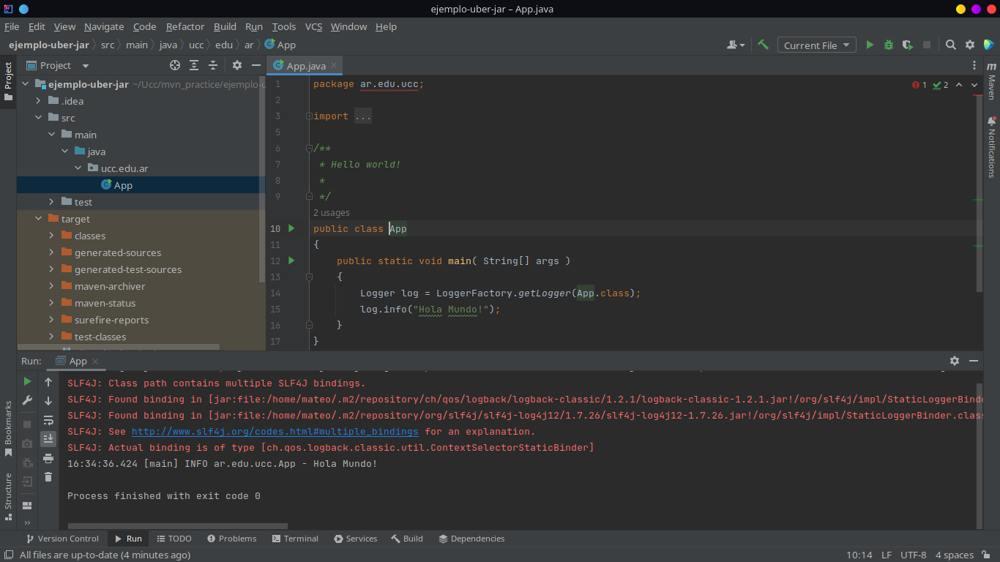

## Ejercicio 8 

Instalamos node:

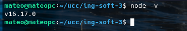

Creamos la app y la corremos:

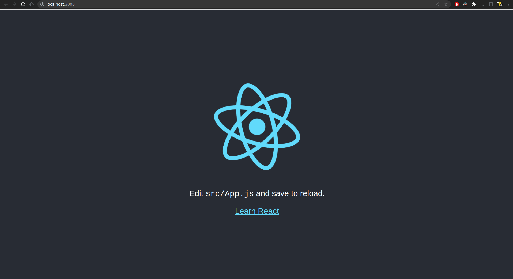

El manejo de paquetes y dependencias de npm utiliza un archivo muy parecido al `pom.xml` de maven. Este archivo se llama package.json y contiene información acerca del programa creado, su version, dependencias junto con sus verciones y hasta algunos "scripts" que podemos correr utilizando npm para automatizar distintas funciones como `start`, `build`, `test`, etc.

```json
{
  "name": "my-app",
  "version": "0.1.0",
  "private": true,
  "dependencies": {
    "@testing-library/jest-dom": "^5.16.5",
    "@testing-library/react": "^13.4.0",
    "@testing-library/user-event": "^13.5.0",
    "react": "^18.2.0",
    "react-dom": "^18.2.0",
    "react-scripts": "5.0.1",
    "web-vitals": "^2.1.4"
  },
  "scripts": {
    "start": "react-scripts start",
    "build": "react-scripts build",
    "test": "react-scripts test",
    "eject": "react-scripts eject"
  },
  "eslintConfig": {
    "extends": [
      "react-app",
      "react-app/jest"
    ]
  },
  "browserslist": {
    "production": [
      ">0.2%",
      "not dead",
      "not op_mini all"
    ],
    "development": [
      "last 1 chrome version",
      "last 1 firefox version",
      "last 1 safari version"
    ]
  }
}
```

## Ejercicio 9

Instalamos cookiecutter en nuestro sistema con pip, creamos el proyecto a partir de un template y lo corremos utilizando make. A continuación, en el puerto 5000.

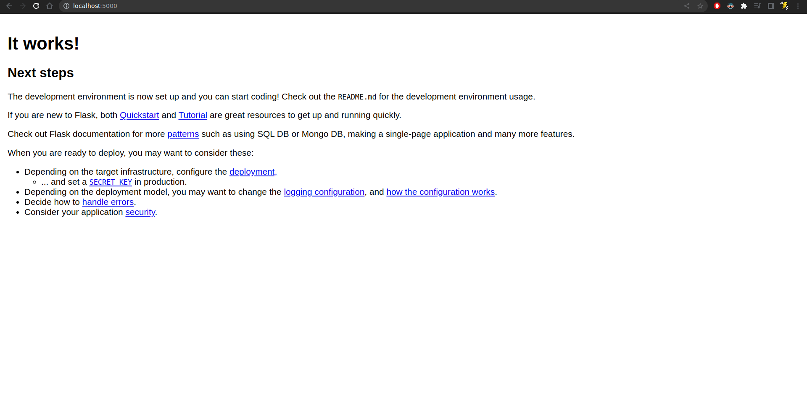

**Cookiecutter** es una utilidad para la interfaz de linea de comandos que nos permite crear proyectos de python a partir de templates o **cookiecutters**.

**make** es una utilidad que nos permite compilar de manera sumamente automatizada programas escritos en cualquier lenguaje de programación que se ejecute, compile o interprete mediante una shell. Esto se logra mediante el desarrollo de un archivo llamado **Makefile** que describe la relación entre los archivos de nuestro programa y los comandos a utilizar.

**pip** es una utilidad que nos permite instalar y gestionar paquetes de python.

## Ejercicio 10

- pipenv --> python
- maven --> java
- gradle --> multi lenguaje
- gulp --> js
- nAnt --> .Net
- Grunt --> js
- Ant --> java
- Sbt --> java y Scala 
- Phing --> php
- Jenkins --> servers
