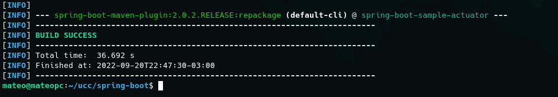
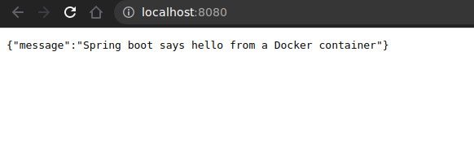
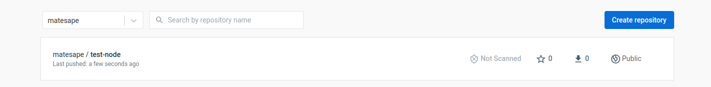

# Trabajo practico N°6

- [Trabajo practico N°6](#trabajo-practico-n6)
  - [Ejercicio 1](#ejercicio-1)
  - [Ejercicio 2](#ejercicio-2)
  - [Ejercicio 3](#ejercicio-3)
  - [Ejercicio 4](#ejercicio-4)
  - [Ejercicio 5](#ejercicio-5)
  - [Ejercicio 6](#ejercicio-6)

## Ejercicio 1

Mediante docker podemos crear imagenes automaticamente mediante un script que no es mas ni menos que un conjunto de instrucciones que docker tendra en cuenta para crear dicha imagen. Este script se llama **DockerFile** y es leido automaticamente siempre que nos situemos en el directorio en donde dicho fichero se encuentre y ejecutando el comando `docker build`.

Estas instrucciones se implementan a partir de comandos o palabras reservadas que se detallaran a continuación:

* **FROM**: Para poder crear una imagen personalizada, hay que partir de una imagen base ya creada. El comando `FROM` nos permite realizar esto. Si la imagen es una imagen valida y no se encuentra en nuestra instancia local de docker, **pulleara** una del repositorio remoto de docker-hub. Cabe destacar que este debe ser el primer comando a escribir en un archivo **Dockerfile** (solo precedido opcionalmente por `ARG`)
* **RUN**: Esta instrucción ejecuta cualquier comando en una nueva capa de la imagen, guardando los resultados para que estos puedan ser utilizados en los siguientes pasos del **Dockerfile**. Existen 2 tipos de sintaxis para poder ejecutar esta instrucción:
* **CMD**: Solo puede existir un solo comando `CMD` en un **Dockerfile**. Su principal función es proveer un medio para poder ejecutar un contenedor formado a partir de la respectiva imagen.
* **ADD**: Este comando copia archivos desde el directorio local, o desde equipos remotos mediante URLs al sistema de ficheros de la imagen en los directorios especificados.
* **COPY**: Este comando es similar a ADD con la diferencia que solamente copia archivos y/o directorios desde la maquina local y no desde un equipo remoto mediante una URL al sistema de archivos de la imagen.
* **EXPOSE**: Este comando informa a docker que los contenedores generados a partir de esta imagen escucharan mensajes en los puertos especificados en el momento de ejecución. Cabe destacar que este comando no abre/publica el/los puertos, sino que funciona mas que nada como documentación para que aquel que valla a crear el contenedor con el comando `docker run` utilize la flag `-p` para publicar dichos puertos.
* **ENTRYPOINT**: Este comando nos permite ejecutar un contenedor que correra como un ejecutable. A diferencia del comando `CMD`, los comandos definidos con `ENTRYPOINT` no pueden ser ignorados o sobreescritos.

## Ejercicio 2

Compilamos el proyecto:

Creamos la imagen de docker utilizando el dockerfile especificado en la consigna, creamos y corremos el contenedor con los respectivos comandos.

## Ejercicio 3

Luego de cambiar el contenido del archivo Dockerfile y construir nuevamente la imagen, analizamos el nuevo contenido de dicho archivo y sacamos como conclusión que en terminos generales, lo que hace esta nueva secuencia de instrucciones es realizar el proceso en 2 etapas, en la primera compila el codigo y genera los archivos .jar necesarios para poder ser ejecutado.

Luego en la segunda etapa, en vez de partir de una imagen de maven, parte de una imagen de java, reduciendo asi el tamaño de la imagen de manera considerable. copia de la etapa anterior los archivos .jar generados que son necesarios para ejecutar la aplicación y genera una imagen similar a la del ejercicio anterior, permitiendonos crear un contenedor con la aplicación spring-boot en funcionamiento.

## Ejercicio 4

Este comando nos levanto 2 contenedores, uno **app** y otro **redis**. El contenedor **app** se creo a partir de una imagen a su vez creada a partir del archivo **Dockerfile** encontrado en la raiz del directorio del proyecto. `docker-compose` permite esto mediante la especificación de la ubicación de dicho archivo mediante la key `build.context`.

## Ejercicio 5

El archivo Dockerfile se adjunta a este trabajo practico. Los comandos utilizados fueron:

`docker build -t test-node .`

y

`docker run -p 3000:80 test-node`

## Ejercicio 6

