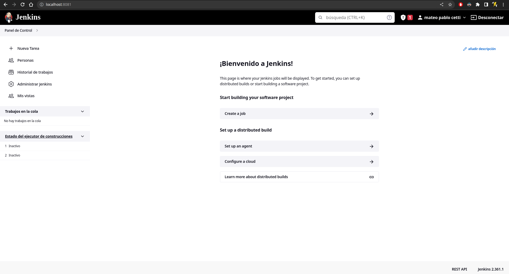
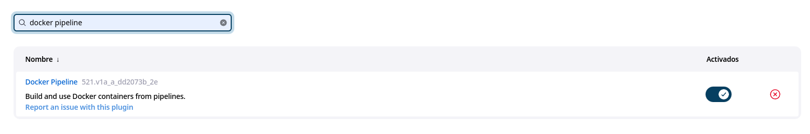
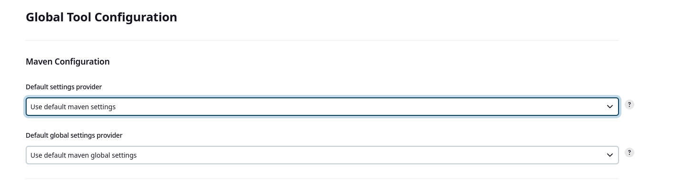
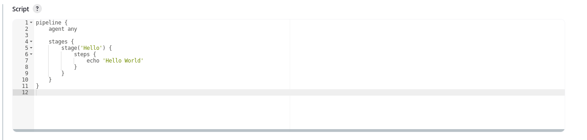
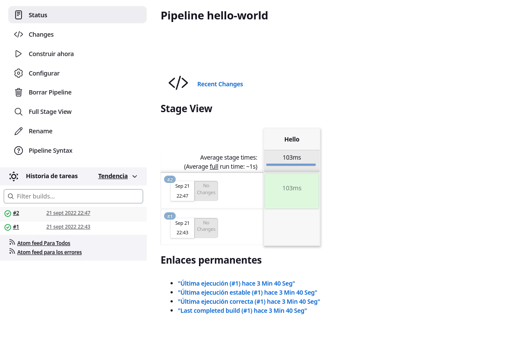
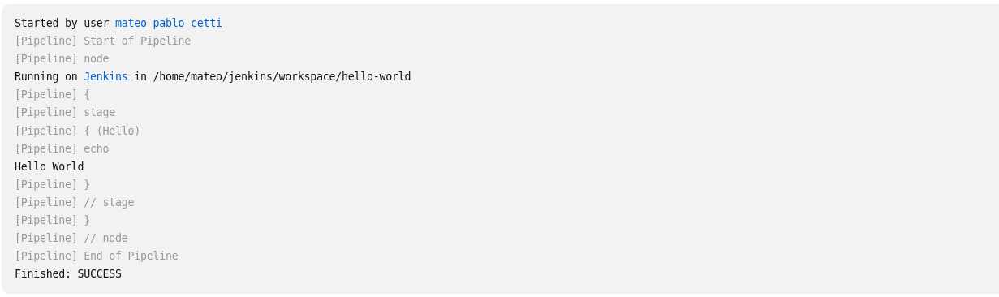
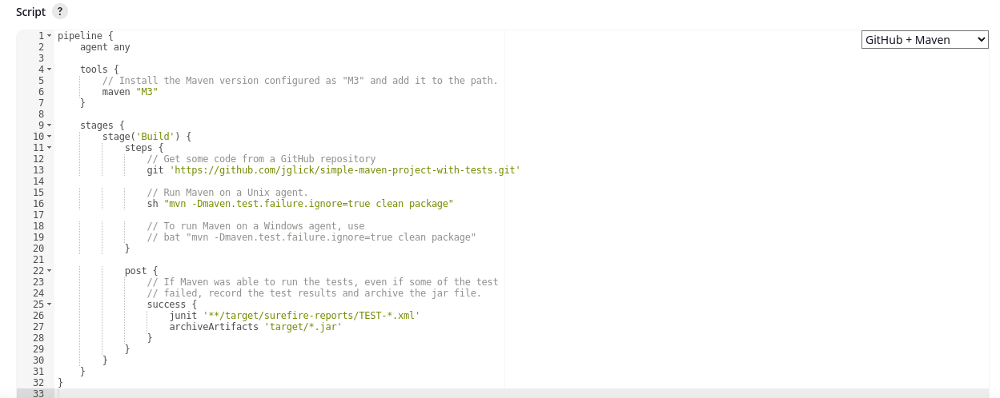
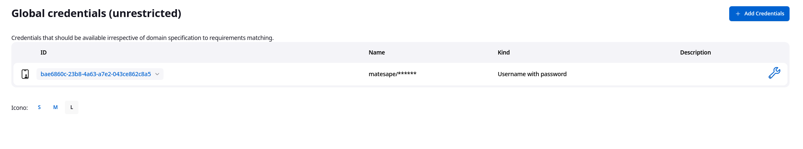
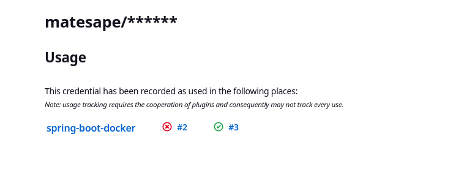
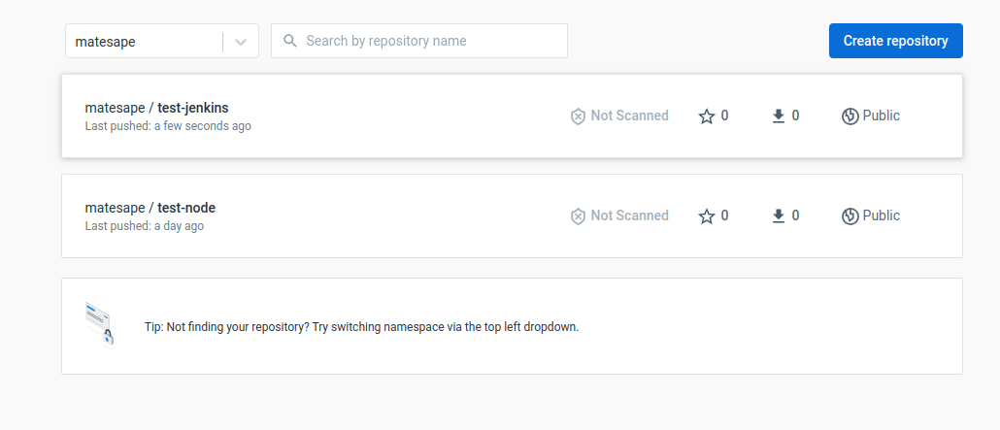

# Trabajo practico N°7

- [Trabajo practico N°7](#trabajo-practico-n7)
  - [Ejercicio 1](#ejercicio-1)
  - [Ejercicio 2](#ejercicio-2)
  - [Ejercicio 3](#ejercicio-3)
  - [Ejercicio 4](#ejercicio-4)
  - [Ejercicio 5](#ejercicio-5)
  - [Ejercicio 6](#ejercicio-6)
  - [Ejercicio 7](#ejercicio-7)

## Ejercicio 1



## Ejercicio 2

__TODO__ con profe

## Ejercicio 3

Instalamos docker pipeline



Verificamos la configuración de maven:



## Ejercicio 4

Creamos y ejecutamos el pipeline. El resultado obtenido fue el siguiente:







Como podemos ver, el proceso empieza, recorre linea por linea el script y ejecuta el paso especificado, que en este caso es un simple echo "hello world" y termina satisfactoriamente.

## Ejercicio 5 



Este script utiliza maven "M3" como herramienta y consta de un "stage" con 2 steps y un post del resultado.

Los steps son principalmente obtener un proyecto ejecutable con mvn desde github y compilarlo haciendo uso de dicha herramienta.

Luego, guarda los logs (principalmente los tests) en un archivo y el ejecutable .jar en una carpeta `/target`

Output:

```sh
Started by user mateo pablo cetti
[Pipeline] Start of Pipeline
[Pipeline] node
Running on Jenkins in /home/mateo/jenkins/workspace/simple-maven
[Pipeline] {
[Pipeline] stage
[Pipeline] { (Declarative: Tool Install)
[Pipeline] tool
Unpacking https://repo.maven.apache.org/maven2/org/apache/maven/apache-maven/3.8.6/apache-maven-3.8.6-bin.zip to /home/mateo/jenkins/tools/hudson.tasks.Maven_MavenInstallation/M3 on Jenkins
[Pipeline] envVarsForTool
[Pipeline] }
[Pipeline] // stage
[Pipeline] withEnv
[Pipeline] {
[Pipeline] stage
[Pipeline] { (Build)
[Pipeline] tool
[Pipeline] envVarsForTool
[Pipeline] withEnv
[Pipeline] {
[Pipeline] git
The recommended git tool is: NONE
No credentials specified
Cloning the remote Git repository
Cloning repository https://github.com/jglick/simple-maven-project-with-tests.git
 > git init /home/mateo/jenkins/workspace/simple-maven # timeout=10
Fetching upstream changes from https://github.com/jglick/simple-maven-project-with-tests.git
 > git --version # timeout=10
 > git --version # 'git version 2.30.2'
 > git fetch --tags --force --progress -- https://github.com/jglick/simple-maven-project-with-tests.git +refs/heads/*:refs/remotes/origin/* # timeout=10
 > git config remote.origin.url https://github.com/jglick/simple-maven-project-with-tests.git # timeout=10
 > git config --add remote.origin.fetch +refs/heads/*:refs/remotes/origin/* # timeout=10
Avoid second fetch
 > git rev-parse refs/remotes/origin/master^{commit} # timeout=10
Checking out Revision 3748ac65b450e23c95c43a96c0139ff0c38da617 (refs/remotes/origin/master)
 > git config core.sparsecheckout # timeout=10
 > git checkout -f 3748ac65b450e23c95c43a96c0139ff0c38da617 # timeout=10
 > git branch -a -v --no-abbrev # timeout=10
 > git checkout -b master 3748ac65b450e23c95c43a96c0139ff0c38da617 # timeout=10
Commit message: "Use `POD_LABEL`"
First time build. Skipping changelog.
[Pipeline] sh
+ mvn -Dmaven.test.failure.ignore=true clean package
[INFO] Scanning for projects...
[INFO] 
[INFO] ----------------< test:simple-maven-project-with-tests >----------------
[INFO] Building simple-maven-project-with-tests 1.0-SNAPSHOT
[INFO] --------------------------------[ jar ]---------------------------------
Downloading from central: https://repo.maven.apache.org/maven2/org/apache/maven/plugins/maven-clean-plugin/2.5/maven-clean-plugin-2.5.pom
Progress (1): 2.7/3.9 kB
Progress (1): 3.9 kB    

...

[INFO] Building jar: /home/mateo/jenkins/workspace/simple-maven/target/simple-maven-project-with-tests-1.0-SNAPSHOT.jar
[INFO] ------------------------------------------------------------------------
[INFO] BUILD SUCCESS
[INFO] ------------------------------------------------------------------------
[INFO] Total time:  28.741 s
[INFO] Finished at: 2022-09-21T22:54:25-03:00
[INFO] ------------------------------------------------------------------------
Post stage
[Pipeline] junit
Recording test results
[Checks API] No suitable checks publisher found.
[Pipeline] archiveArtifacts
Archiving artifacts
[Pipeline] }
[Pipeline] // withEnv
[Pipeline] }
[Pipeline] // stage
[Pipeline] }
[Pipeline] // withEnv
[Pipeline] }
[Pipeline] // node
[Pipeline] End of Pipeline
Finished: SUCCESS
```

## Ejercicio 6

El script es muy similar al del ejercicio anterior, solamente que cambiando el repositorio por defecto por mi [repositorio del proyecto del ejercicio anterior](https://github.com/MateoCetti/isw-3-spring-boot), ademas de un parametro adicional para establecer la rama a utilizar (ya que por defecto, jenkins toma la rama master y no la main).

```
pipeline {
    agent any

    tools {
        // Install the Maven version configured as "M3" and add it to the path.
        maven "M3"
    }

    stages {
        stage('Build') {
            steps {
                // Get some code from a GitHub repository
                git branch: "main", url: 'https://github.com/MateoCetti/isw-3-spring-boot.git'

                // Run Maven on a Unix agent.
                sh "mvn -Dmaven.test.failure.ignore=true clean package"

                // To run Maven on a Windows agent, use
                // bat "mvn -Dmaven.test.failure.ignore=true clean package"
            }

            post {
                // If Maven was able to run the tests, even if some of the test
                // failed, record the test results and archive the jar file.
                success {
                    junit '**/target/surefire-reports/TEST-*.xml'
                    archiveArtifacts 'target/*.jar'
                }
            }
        }
    }
}
```

El resultado fue el siguiente:

```
Started by user mateo pablo cetti
[Pipeline] Start of Pipeline
[Pipeline] node
Running on Jenkins in /home/mateo/jenkins/workspace/spring-boot
[Pipeline] {
[Pipeline] stage
[Pipeline] { (Declarative: Tool Install)
[Pipeline] tool
[Pipeline] envVarsForTool
[Pipeline] }
[Pipeline] // stage
[Pipeline] withEnv
[Pipeline] {
[Pipeline] stage
[Pipeline] { (Build)
[Pipeline] tool
[Pipeline] envVarsForTool
[Pipeline] withEnv
[Pipeline] {
[Pipeline] git
The recommended git tool is: NONE
No credentials specified
 > git rev-parse --resolve-git-dir /home/mateo/jenkins/workspace/spring-boot/.git # timeout=10
Fetching changes from the remote Git repository
 > git config remote.origin.url https://github.com/MateoCetti/isw-3-spring-boot.git # timeout=10
Fetching upstream changes from https://github.com/MateoCetti/isw-3-spring-boot.git
 > git --version # timeout=10
 > git --version # 'git version 2.30.2'
 > git fetch --tags --force --progress -- https://github.com/MateoCetti/isw-3-spring-boot.git +refs/heads/*:refs/remotes/origin/* # timeout=10
 > git rev-parse refs/remotes/origin/main^{commit} # timeout=10
Checking out Revision f765b13044f1751098e37c8b3fb66c42e9c20317 (refs/remotes/origin/main)
 > git config core.sparsecheckout # timeout=10
 > git checkout -f f765b13044f1751098e37c8b3fb66c42e9c20317 # timeout=10
 > git branch -a -v --no-abbrev # timeout=10
 > git checkout -b main f765b13044f1751098e37c8b3fb66c42e9c20317 # timeout=10
Commit message: "first commit"
First time build. Skipping changelog.
[Pipeline] sh
+ mvn -Dmaven.test.failure.ignore=true clean package
[INFO] Scanning for projects...
[INFO] 
[INFO] --------< org.springframework.boot:spring-boot-sample-actuator >--------
[INFO] Building Spring Boot Actuator Sample 2.0.2
[INFO] --------------------------------[ jar ]---------------------------------
[INFO] 
[INFO] --- maven-clean-plugin:3.0.0:clean (default-clean) @ spring-boot-sample-actuator ---
[INFO] 
[INFO] --- maven-resources-plugin:3.0.1:resources (default-resources) @ spring-boot-sample-actuator ---
[INFO] Using 'UTF-8' encoding to copy filtered resources.
[INFO] Copying 1 resource
[INFO] Copying 1 resource
[INFO] 
[INFO] --- maven-compiler-plugin:3.7.0:compile (default-compile) @ spring-boot-sample-actuator ---
[INFO] Changes detected - recompiling the module!
[INFO] Compiling 6 source files to /home/mateo/jenkins/workspace/spring-boot/target/classes
[INFO] 
[INFO] --- maven-resources-plugin:3.0.1:testResources (default-testResources) @ spring-boot-sample-actuator ---
[INFO] Using 'UTF-8' encoding to copy filtered resources.
[INFO] Copying 1 resource
[INFO] 
[INFO] --- maven-compiler-plugin:3.7.0:testCompile (default-testCompile) @ spring-boot-sample-actuator ---
[INFO] Changes detected - recompiling the module!
[INFO] Compiling 3 source files to /home/mateo/jenkins/workspace/spring-boot/target/test-classes
[INFO] 
[INFO] --- maven-surefire-plugin:2.9:test (default-test) @ spring-boot-sample-actuator ---
[INFO] Surefire report directory: /home/mateo/jenkins/workspace/spring-boot/target/surefire-reports

-------------------------------------------------------
 T E S T S
-------------------------------------------------------
Running sample.actuator.ExampleInfoContributorTest
Tests run: 1, Failures: 0, Errors: 0, Skipped: 0, Time elapsed: 0.345 sec
Running sample.actuator.HelloWorldServiceTest
Tests run: 1, Failures: 0, Errors: 0, Skipped: 0, Time elapsed: 0 sec

Results :

Tests run: 2, Failures: 0, Errors: 0, Skipped: 0

[INFO] 
[INFO] --- maven-jar-plugin:3.0.2:jar (default-jar) @ spring-boot-sample-actuator ---
[INFO] Building jar: /home/mateo/jenkins/workspace/spring-boot/target/spring-boot-sample-actuator-2.0.2.jar
[INFO] 
[INFO] --- spring-boot-maven-plugin:2.0.2.RELEASE:repackage (default) @ spring-boot-sample-actuator ---
[INFO] ------------------------------------------------------------------------
[INFO] BUILD SUCCESS
[INFO] ------------------------------------------------------------------------
[INFO] Total time:  3.108 s
[INFO] Finished at: 2022-09-21T23:31:14-03:00
[INFO] ------------------------------------------------------------------------
Post stage
[Pipeline] junit
Recording test results
[Checks API] No suitable checks publisher found.
[Pipeline] archiveArtifacts
Archiving artifacts
[Pipeline] }
[Pipeline] // withEnv
[Pipeline] }
[Pipeline] // stage
[Pipeline] }
[Pipeline] // withEnv
[Pipeline] }
[Pipeline] // node
[Pipeline] End of Pipeline
Finished: SUCCESS
```

## Ejercicio 7

En mi caso, yo utilice comandos de shell en vez del plugin de docker. Las credenciales las cree en un entorno global:





El script quedaria de la siguiente manera:

```jenkins
pipeline {
    agent any

    tools {
        // Install the Maven version configured as "M3" and add it to the path.
        maven "M3"
    }

    stages {
        stage('Build') {
            steps {
                // Get some code from a GitHub repository
                git branch: "main", url: 'https://github.com/MateoCetti/isw-3-spring-boot.git'

                // Run Maven on a Unix agent.
                sh "mvn -Dmaven.test.failure.ignore=true clean package"

                // To run Maven on a Windows agent, use
                // bat "mvn -Dmaven.test.failure.ignore=true clean package"
            }

            post {
                // If Maven was able to run the tests, even if some of the test
                // failed, record the test results and archive the jar file.
                success {
                    junit '**/target/surefire-reports/TEST-*.xml'
                    archiveArtifacts 'target/*.jar'
                }
            }
        }
        
        stage('Docker upload') {
             environment {
                DOCKER_CREDS = credentials('bae6860c-23b8-4a63-a7e2-043ce862c8a5')
            }
            steps {
                sh 'docker login -u $DOCKER_CREDS_USR -p $DOCKER_CREDS_PSW'
                
                sh 'docker build -t "test-jenkins" .'
                
                sh 'docker tag test-jenkins matesape/test-jenkins:latest'
                
                sh 'docker push matesape/test-jenkins:latest'
            }
        }
    }
}
```

El resultado fue el siguiente:

```
Started by user mateo pablo cetti
[Pipeline] Start of Pipeline
[Pipeline] node
Running on Jenkins in /home/mateo/jenkins/workspace/spring-boot-docker
[Pipeline] {
[Pipeline] stage
[Pipeline] { (Declarative: Tool Install)
[Pipeline] tool
[Pipeline] envVarsForTool
[Pipeline] }
[Pipeline] // stage
[Pipeline] withEnv
[Pipeline] {
[Pipeline] stage
[Pipeline] { (Build)
[Pipeline] tool
[Pipeline] envVarsForTool
[Pipeline] withEnv
[Pipeline] {
[Pipeline] git
The recommended git tool is: NONE
No credentials specified
 > git rev-parse --resolve-git-dir /home/mateo/jenkins/workspace/spring-boot-docker/.git # timeout=10
Fetching changes from the remote Git repository
 > git config remote.origin.url https://github.com/MateoCetti/isw-3-spring-boot.git # timeout=10
Fetching upstream changes from https://github.com/MateoCetti/isw-3-spring-boot.git
 > git --version # timeout=10
 > git --version # 'git version 2.30.2'
 > git fetch --tags --force --progress -- https://github.com/MateoCetti/isw-3-spring-boot.git +refs/heads/*:refs/remotes/origin/* # timeout=10
 > git rev-parse refs/remotes/origin/main^{commit} # timeout=10
Checking out Revision f765b13044f1751098e37c8b3fb66c42e9c20317 (refs/remotes/origin/main)
 > git config core.sparsecheckout # timeout=10
 > git checkout -f f765b13044f1751098e37c8b3fb66c42e9c20317 # timeout=10
 > git branch -a -v --no-abbrev # timeout=10
 > git branch -D main # timeout=10
 > git checkout -b main f765b13044f1751098e37c8b3fb66c42e9c20317 # timeout=10
Commit message: "first commit"
 > git rev-list --no-walk f765b13044f1751098e37c8b3fb66c42e9c20317 # timeout=10
[Pipeline] sh
+ mvn -Dmaven.test.failure.ignore=true clean package
[INFO] Scanning for projects...
[INFO] 
[INFO] --------< org.springframework.boot:spring-boot-sample-actuator >--------
[INFO] Building Spring Boot Actuator Sample 2.0.2
[INFO] --------------------------------[ jar ]---------------------------------
[INFO] 
[INFO] --- maven-clean-plugin:3.0.0:clean (default-clean) @ spring-boot-sample-actuator ---
[INFO] Deleting /home/mateo/jenkins/workspace/spring-boot-docker/target
[INFO] 
[INFO] --- maven-resources-plugin:3.0.1:resources (default-resources) @ spring-boot-sample-actuator ---
[INFO] Using 'UTF-8' encoding to copy filtered resources.
[INFO] Copying 1 resource
[INFO] Copying 1 resource
[INFO] 
[INFO] --- maven-compiler-plugin:3.7.0:compile (default-compile) @ spring-boot-sample-actuator ---
[INFO] Changes detected - recompiling the module!
[INFO] Compiling 6 source files to /home/mateo/jenkins/workspace/spring-boot-docker/target/classes
[INFO] 
[INFO] --- maven-resources-plugin:3.0.1:testResources (default-testResources) @ spring-boot-sample-actuator ---
[INFO] Using 'UTF-8' encoding to copy filtered resources.
[INFO] Copying 1 resource
[INFO] 
[INFO] --- maven-compiler-plugin:3.7.0:testCompile (default-testCompile) @ spring-boot-sample-actuator ---
[INFO] Changes detected - recompiling the module!
[INFO] Compiling 3 source files to /home/mateo/jenkins/workspace/spring-boot-docker/target/test-classes
[INFO] 
[INFO] --- maven-surefire-plugin:2.9:test (default-test) @ spring-boot-sample-actuator ---
[INFO] Surefire report directory: /home/mateo/jenkins/workspace/spring-boot-docker/target/surefire-reports

-------------------------------------------------------
 T E S T S
-------------------------------------------------------
Running sample.actuator.ExampleInfoContributorTest
Tests run: 1, Failures: 0, Errors: 0, Skipped: 0, Time elapsed: 0.256 sec
Running sample.actuator.HelloWorldServiceTest
Tests run: 1, Failures: 0, Errors: 0, Skipped: 0, Time elapsed: 0 sec

Results :

Tests run: 2, Failures: 0, Errors: 0, Skipped: 0

[INFO] 
[INFO] --- maven-jar-plugin:3.0.2:jar (default-jar) @ spring-boot-sample-actuator ---
[INFO] Building jar: /home/mateo/jenkins/workspace/spring-boot-docker/target/spring-boot-sample-actuator-2.0.2.jar
[INFO] 
[INFO] --- spring-boot-maven-plugin:2.0.2.RELEASE:repackage (default) @ spring-boot-sample-actuator ---
[INFO] ------------------------------------------------------------------------
[INFO] BUILD SUCCESS
[INFO] ------------------------------------------------------------------------
[INFO] Total time:  2.241 s
[INFO] Finished at: 2022-09-21T23:55:38-03:00
[INFO] ------------------------------------------------------------------------
Post stage
[Pipeline] junit
Recording test results
[Checks API] No suitable checks publisher found.
[Pipeline] archiveArtifacts
Archiving artifacts
[Pipeline] }
[Pipeline] // withEnv
[Pipeline] }
[Pipeline] // stage
[Pipeline] stage
[Pipeline] { (Docker upload)
[Pipeline] withCredentials
Masking supported pattern matches of $DOCKER_CREDS or $DOCKER_CREDS_PSW
[Pipeline] {
[Pipeline] tool
[Pipeline] envVarsForTool
[Pipeline] withEnv
[Pipeline] {
[Pipeline] sh
+ docker login -u matesape -p ****
WARNING! Using --password via the CLI is insecure. Use --password-stdin.
WARNING! Your password will be stored unencrypted in /home/mateo/.docker/config.json.
Configure a credential helper to remove this warning. See
https://docs.docker.com/engine/reference/commandline/login/#credentials-store

Login Succeeded
[Pipeline] sh
+ docker build -t test-jenkins .
Sending build context to Docker daemon  25.51MB

Step 1/13 : FROM maven:3.5.2-jdk-8-alpine AS MAVEN_TOOL_CHAIN
 ---> 293423a981a7
Step 2/13 : COPY pom.xml /tmp/
 ---> Using cache
 ---> f69c2f4e93e9
Step 3/13 : RUN mvn -B dependency:go-offline -f /tmp/pom.xml -s /usr/share/maven/ref/settings-docker.xml
 ---> Using cache
 ---> af54a95891e3
Step 4/13 : COPY src /tmp/src/
 ---> Using cache
 ---> 36ec65d53bd0
Step 5/13 : WORKDIR /tmp/
 ---> Using cache
 ---> e9c70168ae63
Step 6/13 : RUN mvn -B -s /usr/share/maven/ref/settings-docker.xml package
 ---> Using cache
 ---> 8b86c8025f08
Step 7/13 : FROM openjdk:8-jre-alpine
 ---> f7a292bbb70c
Step 8/13 : EXPOSE 8080
 ---> Using cache
 ---> 90540d4685a7
Step 9/13 : RUN mkdir /app
 ---> Using cache
 ---> 6038aeaba658
Step 10/13 : COPY --from=MAVEN_TOOL_CHAIN /tmp/target/*.jar /app/spring-boot-application.jar
 ---> Using cache
 ---> bc84d2fa9aae
Step 11/13 : ENV JAVA_OPTS="-Xms32m -Xmx128m"
 ---> Using cache
 ---> 33e6e02d93bf
Step 12/13 : ENTRYPOINT exec java $JAVA_OPTS -Djava.security.egd=file:/dev/./urandom -jar /app/spring-boot-application.jar
 ---> Using cache
 ---> 912effaa8e67
Step 13/13 : HEALTHCHECK --interval=1m --timeout=3s CMD wget -q -T 3 -s http://localhost:8080/actuator/health/ || exit 1
 ---> Using cache
 ---> 567be28ec019
Successfully built 567be28ec019
Successfully tagged test-jenkins:latest
[Pipeline] sh
+ docker tag test-jenkins matesape/test-jenkins:latest
[Pipeline] sh
+ docker push matesape/test-jenkins:latest
The push refers to repository [docker.io/matesape/test-jenkins]
1e81a778934e: Preparing
d35c4ab6d9b2: Preparing
edd61588d126: Preparing
9b9b7f3d56a0: Preparing
f1b5933fe4b5: Preparing
edd61588d126: Mounted from library/openjdk
9b9b7f3d56a0: Mounted from library/openjdk
f1b5933fe4b5: Mounted from library/openjdk
d35c4ab6d9b2: Pushed
1e81a778934e: Pushed
latest: digest: sha256:f023a2fd132542b89210b5da551b179f806c9b79b412c92655233076442eb5ee size: 1366
[Pipeline] }
[Pipeline] // withEnv
[Pipeline] }
[Pipeline] // withCredentials
[Pipeline] }
[Pipeline] // stage
[Pipeline] }
[Pipeline] // withEnv
[Pipeline] }
[Pipeline] // node
[Pipeline] End of Pipeline
Finished: SUCCESS
```

Y como podemos ver, la imagen se pusheo a docker hub satisfactoriamente:



Adjunto este nuevo jenkinsfile como `jenkinsfile_2` a la carpeta de spring-boot contenida en el mismo directorio que este archivo Markdown.
