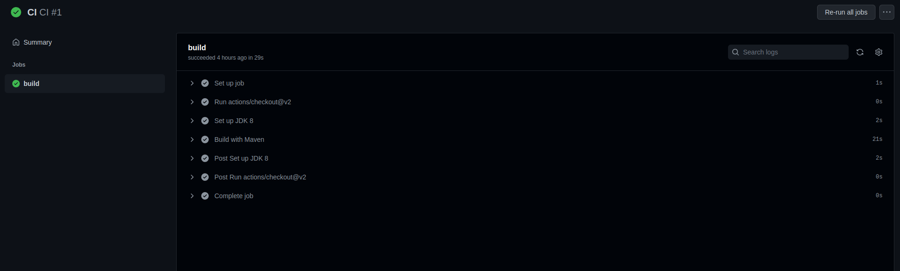
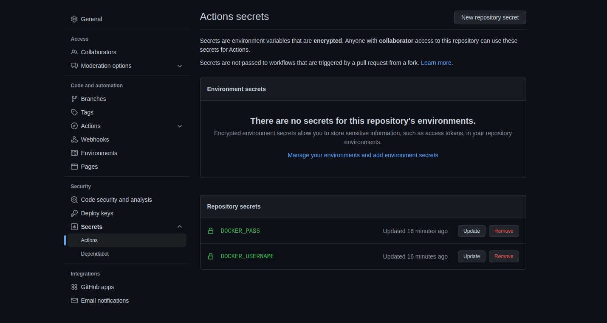
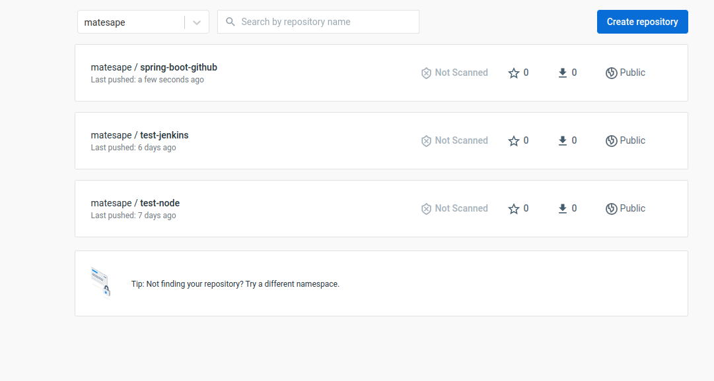
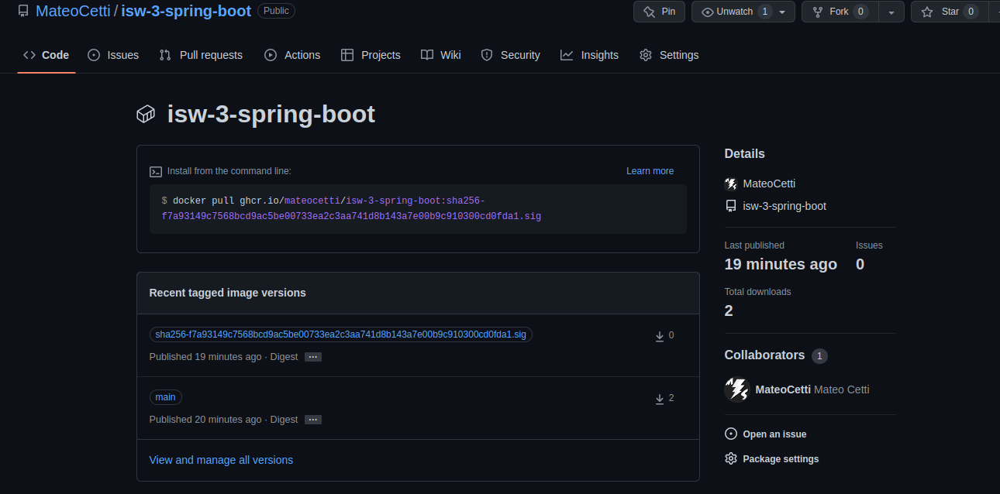

# Trabajo Practico N° 8

- [Trabajo Practico N° 8](#trabajo-practico-n-8)
  - [Ejercicio 1](#ejercicio-1)
  - [Ejercicio 2](#ejercicio-2)
  - [Ejercicio 3](#ejercicio-3)

## Ejercicio 1

La integración continua nativa en la nube es simplemente una integración continua que puede admitir servicios en la nube que se usan a menudo en el desarrollo nativo en la nube.

La nube nativa ofrece oportunidades en términos de velocidad y escala, pero también aumenta la complejidad. Los equipos de ingeniería nativos de la nube necesitan mayor automatización y estabilidad, y herramientas de CI/CD diseñadas para admitir la complejidad que surge del desarrollo en un entorno de microservicios.

Para un mejor desarrollo nativo en la nube, los equipos deben asegurarse de que sus soluciones de integración continua estén optimizadas para los servicios en la nube que usan comúnmente

## Ejercicio 2

El job llamado "build" (mismo que utiliza como "runner" `ubuntu-latest`) consta de 3 pasos:
- Utiliza la action ` actions/checkout@v2` que permite que el job acceda al repo
- Instalamos JDK con maven
- Buildeamos y corremos el programa con maven

**Nota**: El [codigo del script](https://github.com/MateoCetti/isw-3-spring-boot/blob/main/.github/workflows/maven.yml) de github actions se puede encontrar en el directorio `./git/workflows` del repositorio.

## Ejercicio 3

Creamos el [script](https://github.com/MateoCetti/isw-3-spring-boot/blob/main/.github/workflows/docker-publish.yml), establecemos los secretos y corremos el job.

Y como podemos ver, la nueva imagen se subio a docker hub exitosamente:

Tambien, mediante este [script](https://github.com/MateoCetti/isw-3-spring-boot/blob/main/.github/workflows/docker-image_2.yml) subimos la imagen al [github container repository](https://github.com/MateoCetti/isw-3-spring-boot/pkgs/container/isw-3-spring-boot) en vez de a docker hub.

