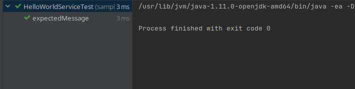
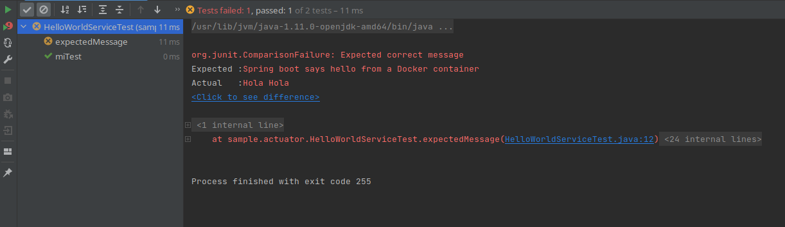
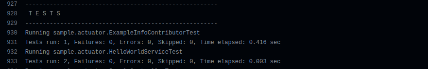
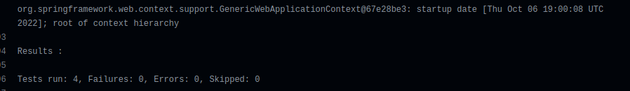

# Trabajo practico N° 9

- [Trabajo practico N° 9](#trabajo-practico-n-9)
  - [Ejercicio 1](#ejercicio-1)
  - [Ejercicio 3](#ejercicio-3)
  - [Ejercicio 4](#ejercicio-4)
  - [Ejercicio 6](#ejercicio-6)

## Ejercicio 1

Esta dependencia: `spring-boot-starter-test` es un "starter" para poder testear aplicaciones spring-boot con las libreras `Junit Jupiter`, `Hamcrest` y `Mockito`.

El test `expectedMessage` crea una instancia de la clase `HelloWorldService` y verifica mediante la sentencia `AssertEquals` de **Junit** que el metodo `getHelloMessage()` de la instancia de `HelloWorldService`retorne el mensaje `Spring boot says hello from a Docker container`.



## Ejercicio 3

En este test se crea un objeto mock de la clase `Info.Builder.class` llamado `builder`, luego le contribuimos información mediante el metodo `contribute()` de la clase `ExampleInfoContributor` y luego se verifica que la clase contenga cualquier tipo de dato.

## Ejercicio 4

Para realizar este ejercicio, agregue el siguiente test:

```java
	@Test
	public void miTest() {
		HelloWorldService helloWorldService = new HelloWorldService();
		assertEquals("Hola Hola","Hola Hola",helloWorldService.getHelloMessage());
		assertEquals("Hello Hello","Hello Hello",helloWorldService.getHelloMessage());
	}
```

y modifique la clase `HelloWorldService` para que realice lo siguiente:

```java
@Component
public class HelloWorldService {

	private int contador = 0;

	public String getHelloMessage() {
		if (contador == 0) {
		    contador++;
			return "Hola Hola";
		}
        contador++;
		return "Hello Hello";
	}

}
```

Es decir, añadi un atributo `contador` a la clase inicializado en 0 de tal forma que cada vez que se llama a la función `getHelloMessage()` se incremente. Ademas, la función verifica el valor de este contador de la siguiente manera:

* En el caso de ser 0: Es porque la función se llamo por primera vez, por lo que devuelve el string **"Hola Hola"**
* En cualquier otro caso: La función ya se llamo por primera vez por lo que devolvemos el string **"Hello Hello"**

Como podemos ver, cuando ejecutamos los test de este archivo, este nuevo test corre exitosamente, pero el test anterior falla debido a que el `assert` espera otra cadena de caracteres distinta a la que la función devuelve:



**Nota**: El codigo se puede encontrar en el repositorio de [spring-boot](https://github.com/MateoCetti/isw-3-spring-boot)


En el caso del nuevo test `TestRootMessage` de la nueva clase `SampleControllerTest`, en primer lugar, esta clase hereda de otra clase `AbstractTest` que tiene un atributo **MVC** y un metodo setup que "buildea" dicha variable.

Luego, el test `TestRootMessage` realiza una request a la uri "/" o al enpoint "root" y guarda la response, la cual luego verifica con un `assert` que el status sea igual a 200 SUCCESS y que el contenido sea igual a "Hola, Hola".

## Ejercicio 6

En el repositorio hay un nuevo workflow llamado "Java CI with Maven" - Java CI with Maven, en el job Build y en el step Build se ejecutan los test de manera exitosa:

Linea de log N° 928


